# A conformal support-estimation filter for text-to-image generation

This project takes the conformal support estimators of
`ot_meta_paper_and_code/meta_full_paper/` — the order-1 and order-∞ Wasserstein
scores, their task-adaptive and low-cardinality variants, and the empirical
Christoffel function they are related to — and applies them somewhere they were
not designed for: constraining what a pre-trained image generator is allowed to
be asked to draw.

The document is written for a reader who knows conformal prediction and optimal
transport well, and diffusion models not at all. Section 1 supplies the
generative-model background from scratch; section 2 fixes notation and states
precisely where the filter sits; sections 3–6 are the method and the results;
section 7 says what to use and section 8 what to do next.

Run `python -m pytest` (125 tests, ~20 s) to check the implementation.

---

## Summary

We calibrate a conformal safe set on the text embeddings of 120 nature/landscape
prompts and use it to screen new prompts before generation. **Three findings
matter.**

*The choice of metric dominates every other design decision.* Measuring
distances in the Mahalanobis metric induced by the reference set's covariance,
rather than the raw Euclidean metric of the embedding space, moves detection of
the hardest prompt tier from 0.216 to 0.384 — an effect five times larger than
any other choice we tested. Everything downstream is conditioned on getting this
right.

*The estimators are nearly interchangeable, and the representation is the
binding constraint.* Under that metric the order-1 Wasserstein score and the
inverse empirical Christoffel function are literally the same filter (Spearman
ρ = 0.999998), and the spread across all six estimators is under 0.05. Nine
out-of-domain prompts are blocked by nothing at all, because the embedding
places *"a waterfall flowing upward into a cloudless sky"* essentially on top of
*"a waterfall cascading into a pool"*. No score function defined on this
representation can separate them.

*Filtering works; repairing needs an extra, non-statistical choice.* The safe
set detects blatantly out-of-domain prompts perfectly (100%) and the projection
onto it is exact and cheap. But at any radius that preserves coverage, that
region is geometrically much larger than the data it was built from, so
projecting a bad prompt onto it moves it into empty certified space and the
generated image does not change. Section 6 gives a certified way to go further,
at the cost of an explicitly chosen displacement.

**Two claims below are revised by the scaling study in §11**, which repeats the
analysis on a 1000-prompt corpus: task-space reweighting turns out not to
improve discrimination (retracting part of §4.3), and a safe corpus can produce
a perfectly valid coverage guarantee while rejecting two thirds of genuine
in-domain prompts. Read §11 before acting on §4.3 or §7.

**Recommended configuration.** Score `g^(0,5)_(d,∞)` — the order-∞ bottleneck on
the 5 task-nearest anchors — in the Mahalanobis metric, `n_cuts = 0`, deployed
through `lift="sequence"`. For pure screening leave `repair_t = 0`; to actually
alter the image set `repair_t ≈ 0.7` and report it as a design parameter, not a
guarantee.

---

## 1. The problem

### 1.1 What a latent diffusion model is

Stable Diffusion 1.5 generates a 512×512 image from a text prompt. It has four
learned components, and it is worth separating them because the filter touches
exactly one thing and leaves the other three alone.

| component | symbol | size | role |
|---|---|---|---|
| VAE encoder / decoder | $\mathcal E,\ \mathcal D$ | 84 M | move between pixels and a compressed *latent* |
| text encoder (CLIP ViT-L/14) | $\tau_\psi$ | 123 M | turn a prompt string into a numeric conditioning tensor |
| denoising network ("U-Net") | $\epsilon_\phi$ | 860 M | the generative model proper |
| noise schedule + sampler | $\bar\alpha_t$ | — | the fixed recipe that turns noise into a sample |

**Latents.** Generation does not happen in pixel space. The VAE encoder maps an
image $x\in\mathbb R^{512\times512\times3}$ to a latent
$z_0=\mathcal E(x)\in\mathbb R^{4\times64\times64}$, an 8× spatial
downsampling and a 48× reduction in dimension. The decoder $\mathcal D$ inverts
this approximately. Everything below happens on $z$; the decoder is applied once
at the very end.

**The forward process.** Fix a decreasing schedule
$\bar\alpha_1 > \dots > \bar\alpha_T$ with $\bar\alpha_T\approx 0$
(SD 1.5 uses $T=1000$). Define a family of noised latents

$$z_t \;=\; \sqrt{\bar\alpha_t}\, z_0 \;+\; \sqrt{1-\bar\alpha_t}\,\boldsymbol\epsilon,
\qquad \boldsymbol\epsilon\sim\mathcal N(0,I).$$

At $t=0$ this is the clean latent; at $t=T$ it is indistinguishable from white
noise. This process is *fixed*, not learned — it is just a definition.

**The learned part.** A network $\epsilon_\phi(z_t,\,t,\,c)$ is trained to
recover the noise that was added, given the noised latent, the timestep, and a
conditioning tensor $c$:

$$\mathcal L(\phi)\;=\;\mathbb E_{z_0,\,c,\,t,\,\boldsymbol\epsilon}
\Big[\big\|\boldsymbol\epsilon-\epsilon_\phi\big(\sqrt{\bar\alpha_t}z_0+\sqrt{1-\bar\alpha_t}\boldsymbol\epsilon,\;t,\;c\big)\big\|_2^2\Big].$$

Knowing $\boldsymbol\epsilon$ is equivalent to knowing $\nabla_{z_t}\log q(z_t)$
up to scale, so $\epsilon_\phi$ is a score-matching estimate of the noised data
distribution — which is why sampling works.

**"U-Net" is the architecture of $\epsilon_\phi$.** It is a convolutional
encoder–decoder: the encoder halves the spatial resolution a few times while
widening the channels, the decoder mirrors that back up, and skip connections
join each decoder stage to the encoder stage of matching resolution. Drawn as a
diagram the shape is a "U", hence the name. Nothing in the conformal argument
depends on this architecture — it is simply the function class. One property
does matter, and it is the subject of the next subsection: *how $c$ gets in*.

**Sampling.** Draw $z_T\sim\mathcal N(0,I)$ and run the reverse recursion for
$t=T,\dots,1$, each step using $\epsilon_\phi$ to estimate the noise and
subtracting a portion of it. In practice one uses *classifier-free guidance*:
the model is evaluated twice per step, once with the prompt and once with an
empty prompt $c_\varnothing=\tau_\psi(\texttt{""})$, and the two are extrapolated

$$\hat{\boldsymbol\epsilon}_t \;=\; \epsilon_\phi(z_t,t,c_\varnothing)
\;+\; w\,\big[\epsilon_\phi(z_t,t,c)-\epsilon_\phi(z_t,t,c_\varnothing)\big],
\qquad w\approx 7.5 .$$

This sharpens prompt adherence. Finally $x=\mathcal D(z_0)$.

Writing the whole thing as one map, with the sampler and schedule fixed,

$$G:\ (c,\ z_T)\ \longmapsto\ x .$$

**The prompt enters only through $c$.** That is the fact the entire project rests
on.

### 1.2 How the text actually conditions the image

The text encoder is CLIP ViT-L/14. It tokenises the prompt to a fixed length
$L=77$ (padding or truncating), runs a 12-layer causally-masked transformer, and
returns the final hidden states

$$c \;=\; \tau_\psi(p)\ \in\ \mathbb R^{77\times 768}.$$

Row $i$ is the hidden state at token position $i$. Two positions have special
meaning: position 0 is the `[BOS]` marker, and the first occurrence of the
highest token id marks `[EOS]`, at index $e$. Because the transformer is
causally masked, row $e$ has attended to every content token and none of the
padding — it is CLIP's sentence summary, and it is the row CLIP itself uses for
image–text retrieval.

$c$ reaches the U-Net through **cross-attention**, and nowhere else. At each of
16 cross-attention blocks, let $\varphi\in\mathbb R^{n\times d_\varphi}$ be the
flattened spatial feature map at that resolution ($n=64^2, 32^2, 16^2, 8^2$).
The block computes

$$Q=\varphi W_Q,\qquad K=c\,W_K,\qquad V=c\,W_V,\qquad
\varphi \leftarrow \varphi+\mathrm{softmax}\!\Big(\tfrac{QK^\top}{\sqrt{d_k}}\Big)V .$$

Each spatial position forms a query; **each of the 77 rows of $c$ supplies one
key and one value**. Every row participates, including the padded ones after
`[EOS]`. SD 1.5 uses no other function of $c$ — in particular, no pooled vector.

Two consequences that shape everything later:

1. A filter that *reads* one row of $c$ is reading $768$ of $59\,136$ numbers,
   about **1.3%** of what the generator sees.
2. A filter that *writes* to one row changes one of 77 keys and values, and the
   image barely moves. To have an effect it must write to many rows.

That asymmetry between what is scored and what must be edited is the central
engineering tension of the project, and §2.3 formalises it.

### 1.3 What we are filtering, and why here

A prompt filter can live in several places: on the raw string (keyword lists), on
the conditioning tensor, on the latent trajectory, or on the output image (a
classifier). We work on the **conditioning tensor** $c$, for three reasons.

It is the last point at which the prompt exists as a single well-defined object
in a vector space — after this it is diffused across 50 sampler steps and 16
attention blocks. It is *before* the expensive part: a rejected prompt costs one
text-encoder pass (3.8 ms measured) rather than a full generation (8.8 s at 30
steps) — a factor of 2300. And it is
generator-agnostic: any model conditioned on CLIP text embeddings takes the same
filter unchanged.

The cost of that choice is a hard ceiling on what the filter can know, and we
will measure it: the filter sees a text embedding, so it can only be as
discriminative as that embedding is.

**The question we actually ask.** Given a set of prompts that are known-good — a
*safe domain* — decide whether a new prompt belongs to it, with a finite-sample
guarantee on the rate at which genuinely good prompts are wrongly rejected. This
is support estimation, which is exactly what the manuscript's estimators do, and
conformal prediction supplies the guarantee. Our safe domain is
nature/landscape photography, chosen because it makes "out of domain" mean
something concrete and gradable.

---

## 2. Formal setup

### 2.1 Notation

Three vocabularies meet here: the diffusion literature, the manuscript, and the
code. Symbols collide across them, so they are fixed once, here.

| symbol | meaning | in the code |
|---|---|---|
| $p$ | a prompt string | `prompt` |
| $\tau_\psi$ | CLIP text encoder, $\mathcal P\to\mathbb R^{77\times768}$ | `text_encoder` |
| $c=\tau_\psi(p)$ | conditioning tensor, $L\times d = 77\times768$ | `prompt_embeds` |
| $e$ | `[EOS]` row index of $c$ | `eos_idx` |
| $\epsilon_\phi$ | the denoising U-Net | `pipe.unet` |
| $\boldsymbol\epsilon$ | Gaussian noise | — |
| $\bar\alpha_t$ | diffusion noise schedule | `scheduler` |
| $w$ | guidance scale | `guidance_scale` |
| $\theta = R(c)$ | the vector that gets scored | `pooled` / rows / `vec` |
| $\mathcal D=\{\theta_i\}_{i=1}^M$ | reference (anchor) set | `ref`, `anchors_w` |
| $s(\theta;\mathcal D)$ | nonconformity score | `score_*` |
| $\beta$ | **miscoverage level** | `epsilon` ⚠ |
| $\varepsilon$ | **conformal radius** | `radius`, and `alpha` in `ecf.py` ⚠ |
| $\mathcal S$ | the conformal safe set | `region` |
| $\Pi_{\mathcal S}$ | projection onto $\mathcal S$ | `region.project` |

⚠ **Two collisions worth flagging.** The manuscript writes $\beta$ for the
miscoverage level and $\varepsilon$ for the radius; the code has these the other
way round, calling the miscoverage `epsilon`. And $\bar\alpha_t$ (diffusion
schedule) is unrelated to `alpha` in `ecf.py` (the ECF threshold, our
$\varepsilon$). This document uses the manuscript's convention throughout: a
bare $\beta$ is always a miscoverage level, $\varepsilon$ is always a radius.

### 2.2 The correspondence with the meta-learning manuscript

The manuscript studies a deterministic pipeline $f:\mathcal T\to\Theta$ mapping
a *task* $\tau_i$ to a *weight vector* $\theta_i=f(\tau_i)$, and estimates the
support of the pushforward of the task distribution onto $\Theta$. Our setting
has exactly that structure with different contents:

| manuscript | here |
|---|---|
| task $\tau_i$ | the content-token cloud of prompt $i$, $\{c_j\}_{j=1}^{L_i}\subset\mathbb R^{768}$ |
| pipeline $f$ | CLIP's causal-attention pooling, cloud $\mapsto$ `[EOS]` row |
| weight $\theta_i$ | the pooled embedding $c_e\in\mathbb R^{768}$ |
| weight space $\Theta$ | $\mathbb R^{768}$ |
| historical dataset $\mathcal D$ | the 60 reference safe prompts |
| new task | a prompt to be screened |

$f$ is deterministic and continuous, which is what Assumption `as:proximity`
(pipeline continuity) requires: prompts with nearby token clouds have nearby
pooled embeddings. This is what licenses the *adaptive* estimators, which
reweight by proximity in task space.

One deliberate detail: `[BOS]` and `[EOS]` are excluded from the cloud, so
$\tau_i$ is not a trivial copy of the $\theta_i$ it is meant to predict.

There is one genuine departure from the manuscript's setting. There, $\theta_i$
is the output of *training* on task $i$, and the interesting randomness is over
tasks. Here $\theta_i$ is a *deterministic embedding* of prompt $i$, and the
randomness is over which prompts a user writes. The formal object — a point
cloud in a vector space whose support we estimate — is identical, which is why
the estimators port unchanged; but nothing about weight-space geometry
(catastrophic forgetting, model fusion) carries over.

### 2.3 Where the filter enters, precisely

Unfiltered generation is the composition

$$p \;\xrightarrow{\ \tau_\psi\ }\; c \;\xrightarrow{\ G(\cdot,\,z_T)\ }\; x .$$

The filter is a map $\Pi:\mathbb R^{L\times d}\to\mathbb R^{L\times d}$ inserted
in the middle:

$$p \;\xrightarrow{\ \tau_\psi\ }\; c \;\xrightarrow{\ \Pi\ }\; c' \;\xrightarrow{\ G(\cdot,\,z_T)\ }\; x' .$$

$\phi$, the sampler, $z_T$, $\mathcal D$ and $w$ are untouched. That is what
makes the integration seamless — and it is also the precise statement of the
filter's ceiling: it can only express itself through $c$.

Because the conformal machinery works on a vector space and $c$ is a matrix,
$\Pi$ factors into four pieces:

$$\Pi(c)\;=\;\Lambda\big(c,\ \Pi_{\mathcal S}(R(c))\big)$$

- a **reduction** $R:\mathbb R^{L\times d}\to\mathbb R^{D}$ — what gets scored;
- a **safe set** $\mathcal S\subset\mathbb R^{D}$, calibrated conformally;
- a **projection** $\Pi_{\mathcal S}:\mathbb R^{D}\to\mathcal S$;
- a **lift** $\Lambda:\mathbb R^{L\times d}\times\mathbb R^{D}\to\mathbb R^{L\times d}$
  — how the projected vector is written back.

If the lift is *consistent* with the reduction, meaning
$R\big(\Lambda(c,v)\big)=v$ for all $c,v$, then

$$R\big(\Pi(c)\big)\;=\;\Pi_{\mathcal S}\big(R(c)\big)\;\in\;\mathcal S$$

**by construction**. This is the post-condition the implementation certifies:
after filtering, the conditioning is inside the calibrated safe set. Every
combination in the code satisfies it (`test_conformal_guard.py`, 5 scores × 3
lifts).

Three consistent choices of $(R,\Lambda)$ are implemented:

| lift | $D$ | $R(c)$ | $\Lambda(c,v)$ |
|---|---|---|---|
| `pooled` | $768$ | the `[EOS]` row $c_e$ | $c + \mathbf 1\,(v-c_e)^\top$ — add the same correction to every row |
| `per_token` | $768$ | each content row, scored separately | those rows replaced by their projections |
| `sequence` | $59\,136$ | $\mathrm{vec}(c)$ | $\mathrm{vec}^{-1}(v)$ |

A remark that turns out to matter. Under the `pooled` reduction, the lift is not
unique — only row $e$ is constrained, and the other 76 rows are free. Writing
the correction into row $e$ alone would be the minimum-norm choice, but then the
U-Net sees 76 unchanged keys and the image is unaffected. Broadcasting to all
rows is a deliberate choice to make the constraint felt. (Had we pooled by
*averaging* rows instead of taking `[EOS]`, the broadcast would in fact be the
minimum-norm consistent lift — which is presumably why the original
`generate_comparison.py` paired mean-pooling with a broadcast. With `[EOS]`
pooling the pairing is a design decision, not a derivation.)

### 2.4 What a corpus is

The word carries a lot of weight later (§12.5, §15), so it is worth pinning down.

**A corpus is a finite set of prompt strings that the designer declares
acceptable.** Nothing more. It is not discovered, inferred or labelled — it is
*stipulated*. Traced through the pipeline it becomes:

1. a list of strings — `"a misty forest with tall pine trees at dawn"`, ×120;
2. a $(77,768)$ conditioning tensor each, from which two objects are kept:
   $\theta\in\mathbb R^{768}$ (the pooled `[EOS]` row, what gets scored) and
   $\tau\in\mathbb R^{L_i\times768}$ (the content-token cloud, the task descriptor);
3. a **point cloud** $\{\theta_i\}_{i=1}^{N}\subset\mathbb R^{768}$.

**The corpus is where the requirement enters, and the only place it does.** The
estimators, regions, projections and guards are all machinery that takes the
cloud as given. There is no external ground truth about which prompts are safe;
the corpus *is* the specification of the safe domain. Change it and every
downstream number changes — §11.2 measured exactly that.

**Corpus ≠ safe set.** The corpus is a finite sample; the safe set
$\mathcal S\subset\mathbb R^{768}$ is a region. The estimator is the map
between them, and the conformal radius fixes how far the region extends beyond
the sample.

**One corpus, three disjoint roles.** The same set is split by function, and the
guarantee requires the splits to be disjoint:

| role | what it determines |
|---|---|
| geometry / fit | the **metric** — the probabilistic-PCA covariance |
| reference | the **score** — anchors, centroid, or network weights |
| calibration | the **radius** — one order statistic of the scores |

**It is one-class.** There are no negatives anywhere in it. The adversarial
tiers of §4.1 — degenerate, subtle, borderline, the portrait gradient — are
evaluation data and are never calibrated on. This is why the conformal guarantee
covers the *false-rejection* rate only and says nothing whatever about detection:
detection rates in this document are measurements, not guarantees.

**It must be a sample, not a construction.** Exchangeability is an assumption
about how the prompts were *generated*, so a corpus has to be drawn from the
process you care about — not enumerated from what you imagine that process
produces. §11's 1,200 prompts were a construction (14 templates × 7 vocabulary
axes), which is precisely why they failed: a template grid is not a sample from
any process that writes real prompts, and no amount of it becomes one. 120
hand-written prompts were more representative than 1,200 generated ones.

---
---

## 3. The safe set

### 3.1 The estimators

Let $\mathcal D=\{\theta_i\}_{i=1}^M$ be the reference anchors and $\theta$ a
candidate. All six scores below are permutation-invariant in $\mathcal D$, hence
admissible for full conformal prediction as well as the split setting used here.

**Order 1** (`content.tex` `def:sym_score`) — the exact $W_1$ distance between
the empirical measure on $\mathcal D$ and the same measure with a Dirac at
$\theta$ added:

$$s_{d,1}(\theta;\mathcal D)\;=\;\frac{1}{M(M+1)}\sum_{i=1}^{M} d(\theta,\theta_i).$$

An *average* distance: $\theta$ scores low if it is close to the cloud as a
whole.

**Order ∞** (`def:sym_score_inf`) — the bottleneck of the minimum spanning tree
on $\mathcal D\cup\{\theta\}$, optionally after deleting the $n$ heaviest edges:

$$s^{(n)}_{d,\infty}(\theta;\mathcal D)\;=\;B^{(n)}\big(\mathrm{MST}(\mathcal D\cup\{\theta\})\big).$$

A *nearest-neighbour* quantity: for a candidate far from everything, this is
simply its distance to the closest anchor. $\theta$ scores low if it is close to
*something*, however peripheral.

**Adaptive variants** (`adaptation.tex`) condition on the candidate's task. For
order 1, mass is reallocated toward anchors whose tasks are close:

$$g_{d,1}(\tau,\theta;\mathcal D)\;=\;\frac{1}{M+1}\sum_{i=1}^{M} w_i(\tau,\tau_i)\, d(\theta,\theta_i).$$

For order ∞ mass reallocation cannot change a max, so the manuscript prescribes
*selection* instead — keep the $K$ task-nearest anchors and score against those:

$$g^{(n,K)}_{d,\infty}(\tau,\theta;\mathcal D)\;=\;s^{(n)}_{d,\infty}\big(\theta;\{\theta_{\sigma(i)}\}_{i\le K}\big).$$

Task proximity is measured by the order-1 Wasserstein distance between token
clouds, computed exactly with a network-simplex solver.

**Low-cardinality variants** (`lower_cardinality.tex`) replace the $M$ anchors by
$K$ $k$-means centroids $\bar\theta_k$ with masses $w_k$, giving computable
upper bounds on the true transport cost — $\tilde s_{d,1}$ adds a constant
cluster-dispersion term to a weighted sum of centroid distances, and
$\tilde s^{(n)}_{d,\infty}$ replaces the MST by
$\eta_\infty+\max\big(B^{(n)},\min_k[d(\bar\theta_k,\theta)+r_k]\big)$.

**Inverse ECF** (`ecf.tex`), the comparator: $\kappa_1^{-1}(\theta)=1+d_M^2(\theta,\hat\mu)$
under the Mahalanobis metric, with a probabilistic-PCA covariance (top $m=32$
eigenvalues kept, the remaining 736 directions modelled isotropically at
$\gamma$).

### 3.2 Calibration

Split conformal, following `content.tex:325` exactly. Partition the safe prompts
into a reference set $\mathcal D$ ($M=60$) that defines the geometry, a
calibration set ($K=40$) that sets the radius, and a test set (20). Sort the
calibration scores, append $+\infty$, and take

$$\varepsilon \;=\; r_{\lceil (K+1)(1-\beta)\rceil}.$$

If that rank exceeds $K$ the correct radius is $+\infty$ and the safe set is all
of $\mathbb R^D$ — vacuous but valid. This requires $K\ge\lceil 1/\beta\rceil-1$
for a finite radius; at $\beta=0.05$ that is $K\ge19$. The guarantee is

$$\mathbb P\big(s(\theta_{\text{new}};\mathcal D)\le\varepsilon\big)\;\ge\;1-\beta,$$

marginal over the calibration draw and the new prompt, requiring only
exchangeability. With $K=40$ the exact expected coverage is
$\lceil41\times0.95\rceil/41 = 0.9512$.

### 3.3 The metric

Every score takes a metric $d$ as an argument, and the choice is not innocent.
Raw Euclidean distance in CLIP space is dominated by the leading directions of
variation, which encode "this is a nature prompt" — precisely the variation the
safe set is *not* trying to measure. We therefore use the Mahalanobis metric of
the reference split's probabilistic-PCA covariance,

$$d(\theta,\theta')^2=(\theta-\theta')^\top\Sigma^{-1}(\theta-\theta'),\qquad
\Sigma^{-1}=\tfrac1\gamma I+\textstyle\sum_{i\le m}\big(\tfrac1{\lambda_i}-\tfrac1\gamma\big)v_iv_i^\top,$$

implemented as an affine whitening map (`wasserstein.Whitener`) so that
$\|f(\theta)-f(\theta')\|_2 = d(\theta,\theta')$. This is not an arbitrary
choice: `ecf.tex` proves that $s_{d,1}$ under the Mahalanobis metric is exactly
what links the order-1 Wasserstein set to the order-1 inverse-ECF set via
Jensen's inequality. It is the metric under which the two families are
comparable, and §4.3 shows it is worth more than every other decision combined.

---

## 4. Results

### 4.1 Protocol, and how to read the numbers

120 safe prompts, split 60 reference / 40 calibration / 20 test, re-randomised
over 150 splits; $\beta=0.05$. Four adversarial tiers are held fixed and scored
under every split:

| tier | $n$ | character |
|---|---|---|
| `degenerate` | 49 | gibberish, SQL, emoji, wrong domain — lexically obvious |
| `borderline` | 15 | nature-adjacent but unusual (thermal image of a forest, Mars landscape) |
| `subtle` | 37 | fluent nature vocabulary, semantically out of domain |
| `P1`–`P4` | 12 each | a graded person↔landscape continuum |

The `subtle` tier is the one built to discriminate. Its prompts are constructed
for maximum lexical overlap with the safe set and minimum semantic membership —
*"a bathymetric contour map of a lake bed shown as a scenic view"*, *"a
pristine alpine lake with a parking lot and four tour buses"*, *"a waterfall
flowing upward into a cloudless sky"*. A filter that keys on nature vocabulary
lets them all through.

Numbers below are **fractions blocked**. Read them as an operating point: at
$\beta = 0.05$ the filter wrongly rejects about 5 of every 100 legitimate nature
prompts, and in exchange catches the fractions shown of each bad tier. Coverage
should sit at 0.9512; the split-to-split standard error is ≈0.004, so anything
in 0.943–0.959 is consistent with validity.

### 4.2 The comparison

| estimator | safe coverage | degenerate | borderline | subtle |
|---|---|---|---|---|
| ECF (comparator) | 0.949 | 1.000 | 0.540 | 0.372 |
| $s_{d,\infty}$ exact | 0.949 | 1.000 | **0.594** | 0.375 |
| $g^{(0,5)}_{d,\infty}$ | 0.947 | 1.000 | 0.572 | **0.414** |
| $g_{d,1}$, knn-3 mass | 0.946 | 1.000 | 0.578 | 0.408 |

All four hold coverage. All four catch every degenerate prompt. They differ by
at most 0.05 on the tiers that discriminate. In absolute terms the best
estimator catches about 15 of the 37 subtle prompts where the comparator catches
14 — a real but modest gain, consistent across splits (paired difference > 2
s.e.).

The honest reading is that **estimator choice is a second-order decision here**.
That is worth knowing precisely because the manuscript's contribution is the
estimator; on this problem the leverage lies elsewhere, as the next subsection
quantifies.

### 4.3 Which design decisions actually matter

Every effect below is measured on the `subtle` tier at matched coverage, paired
over shared splits within a single experiment. This is the answer to *what to
prioritise*.

| decision | change | effect on subtle detection |
|---|---|---|
| **metric** | raw Euclidean → Mahalanobis | **+0.168** (0.216 → 0.384) |
| **adaptation** | uniform mass → hard knn-3 selection | **+0.029** (0.384 → 0.413) |
| **score family** | order-1 → order-∞ | +0.005 subtle, **+0.049 borderline** |
| **graph cuts** | $n=0$ → $n\ge1$ | **−0.95 on degenerate** (1.000 → 0.05–0.15) |
| **low cardinality** | 60 anchors → 20 centroids | 0.000 (order 1); **+0.031** (order ∞) |

Four things follow.

**The metric is the whole game.** It is worth roughly six times the next-largest
choice. Any future work on this problem that does not fix the metric first is
optimising noise.

**Smooth mass reallocation does not work here; hard selection does.** The
manuscript's default scheme is `inv_power`, $w_i\propto d_i^{-r}$. It
monotonically *degrades* as $r$ grows (at $r=8$: −0.023 versus uniform mass).
The reason is measurable: CLIP token-cloud distances occupy a narrow band —
$31\pm4$, with a within-safe max/min ratio of 1.4 — so an inverse-power law
cannot concentrate, and its effective support stays at 111 of 119 anchors even
at $r=4$. Only a hard cut can concentrate on such a band, and knn-3 does
(+0.029, > 2 s.e.). This is the manuscript's own order-∞ prescription —
selection rather than reallocation — turning out to be correct for order 1 too.

**Graph cuts are actively harmful on a unimodal safe set.** $B^{(n)}$ deletes the
$n$ heaviest MST edges on the assumption that they bridge modes. But when the
candidate *is* the outlier, its own attachment edge is the heaviest, so cutting
deletes precisely the signal. Measured directly: with $M=60$ anchors, the
$n{=}1$ score varies by 0.012 across candidates versus 1.01 at $n{=}0$ — an
80-fold collapse; the score has become nearly constant in $\theta$. Cuts need a
genuinely multimodal reference set. A single-domain safe set is not one.

**Low cardinality is free, and for order ∞ better than free.** $\tilde s_{d,1}$
is flat from $K=5$ to $K=60$ (0.367 throughout): a 12× memory reduction at zero
cost. $\tilde s^{(n)}_{d,\infty}$ has an interior optimum at $K\approx20$–30 that
*beats* the exact score (0.396 vs 0.365), reproducing the manuscript's own
observation on the double-ring and double-moon datasets in a new domain.

### 4.4 A structural result: the ECF and order-1 Wasserstein coincide

Under the Mahalanobis metric, $s_{d,1}$ and the inverse ECF have Spearman
$\rho = 0.999998$ across all 221 prompts. Since conformal calibration is
invariant to strictly increasing transformations of the score, they induce the
*identical* safe set.

This is the Jensen inequality of `ecf.tex` becoming tight. That proof bounds
$\|\hat\mu-\theta\|$ by $\frac1N\sum_i\|\theta_i-\theta\|$; in 768 dimensions
distance concentration makes the bound essentially an equality, because every
$\|\theta_i-\theta\|$ is nearly the same. The theoretical link is exact here,
not approximate — which is a positive result for the manuscript, and also
explains why the two rows are indistinguishable in every table above.

### 4.5 The person↔landscape gradient

The safe set contains human *artefacts* (dock, boats, lighthouse, campsite) but
no human *figures*, so "does it reject portraits?" is really "where does the
boundary fall?". Four equal-step tiers walk that continuum:

| | P1 studio | P2 nature backdrop | P3 environmental | P4 tiny figure |
|---|---|---|---|---|
| every estimator | **1.00** | 0.92–0.96 | 0.39–0.45 | 0.08–0.10 |

All five estimators collapse onto one curve, spread ≤ 0.06. Estimator choice
buys discrimination at the *boundary* of the calibrated domain and nothing at
all against a clean domain shift, where everything is already saturated.

The per-prompt breakdown is more informative than the aggregate. Within P3,
every prompt contains exactly one person, yet: `kayaker` 0.00, `fisherman` 0.06,
`hiker` 0.13 pass, while `a woman in a red coat` 0.97 and `a cyclist on a gravel
road` 0.95 are caught. What separates them is whether the *activity noun is
nature-coded*. **The filter has no representation of human presence at all** —
it is a nature-vocabulary detector, and a person is invisible to it whenever
they arrive wearing a nature-coded noun. If any part of the requirement were "no
human subjects", this construction does not deliver it.

### 4.6 Where every method fails

Nine subtle prompts are blocked by nothing, and they cluster into two kinds:

- **impossible physics** — *"a waterfall flowing upward into a cloudless sky"*,
  *"autumn leaves falling upward from the stream into the canopy"*, *"morning
  fog that pools above the treetops"*;
- **capture artifacts** — *"a stock photography watermark across it"*,
  *"visible JPEG compression blocks and banding"*.

CLIP's pooled embedding places *"waterfall flowing upward"* essentially on top
of *"waterfall cascading down"*. This is a ceiling of the **representation**, not
of the estimator: no score function defined on this vector can separate them,
and no amount of estimator engineering will change that.

---

## 5. Geometry: from scores to regions to projections

A calibrated score *is* a region, $\mathcal S=\{\theta: s(\theta)\le\varepsilon\}$.
All six turn out to be projectable, which is what lets the filter act rather
than merely decide.

| score | region | convex | projection |
|---|---|---|---|
| ECF / $s_{d,1}$ Mahalanobis | ellipsoid | ✅ | closed form; secular root for the Euclidean variant |
| $s_{d,1}$, $g_{d,1}$, $\tilde s_{d,1}$ | weighted sum-of-norms sublevel set | ✅ | exact to tolerance (KKT bisection + IRLS) |
| $s_{d,\infty}$, $g^{(0,K)}_{d,\infty}$ | **union of balls** | ❌ | **exact, closed form** |
| $\tilde s^{(n)}_{d,\infty}$ | union of balls, per-ball radii | ❌ | **exact, closed form** |
| $s^{(n)}_{d,\infty}$, general | union of intersections of unions of balls | ❌ | exact when $c_0-n\le1$ |

The order-∞ case follows from `otinf_region_equivalence.tex` `thm:regions`. Let
$G_\varepsilon(\mathcal D)$ be the threshold graph on the anchors (edge iff
$d\le\varepsilon$), $c_0$ its number of connected components, and $\tau(\theta)$
the number of components $\theta$ is within $\varepsilon$ of. Then

$$\mathcal R_{\mathrm{bn}}=\mathcal R_{\mathrm{geo}}=\{\theta:\ \tau(\theta)\ge c_0-n\},$$

so with $c_0-n=1$ the region is exactly $\bigcup_i B(\theta_i,\varepsilon)$. We
verified this numerically against real MST computations for
$n\in\{0,1,2,3\}$. On this data $c_0=1$ in every split ($\varepsilon=13.98$
exceeds the reference bottleneck 10.70), so the closed-form branch is the one
that runs.

Non-convexity costs nothing here: for a finite union
$\mathrm{dist}(z,\bigcup_kS_k)=\min_k\mathrm{dist}(z,S_k)$, so projecting onto
each piece and keeping the nearest is exact. It costs uniqueness, not
correctness. Convex projections are validated against CVXPY, unions against
brute force.

---

## 6. Projection, and why it does not repair

### 6.1 The negative result

Deployed as a projection, the filter behaves correctly at the endpoints: studio
portraits are always moved, a tiny hiker genuinely part of a landscape is never
touched, prompts already inside come back bit-identical, and the post-condition
holds for all 15 score × lift combinations. But **the generated image does not
change**. The projected skyscraper is still a skyscraper.

The reason is geometric and measurable:

| | whitened units |
|---|---|
| conformal radius $\varepsilon$ | 13.98 |
| median spacing *between* safe anchors | 10.99 |
| degenerate prompt → nearest anchor | 17.46 |
| the same, **after projection** | **13.98** |

The ball radius exceeds the spacing between the anchors themselves. The
calibrated region is substantially larger than the data manifold it was built
from, so the projection stops on a *shell* a full radius from any real safe
prompt — inside the certificate, in a part of it containing no data.

This is structural, and two independent checks confirm it is not a tuning
failure.

*More anchors will not help.* The intrinsic dimension of the safe cloud is
$d_{\mathrm{eff}}\approx30$–41 (two-NN and Levina–Bickel estimators agree).
Nearest-neighbour distance scales as $M^{-1/d_{\mathrm{eff}}}$, so shrinking
$\varepsilon$ by 25% would need **5,700×** more prompts (≈690,000) and halving
it $10^9$.

*No metric will help.* Sweeping the PCA dimension $m$ from 2 to 32 leaves
$\varepsilon/\text{spacing}$ at 1.20–1.38 throughout. Truncating instead —
dropping the isotropic residual to genuinely reduce dimension — collapses
degenerate detection from 1.00 to **0.00**, the exact failure mode `ecf.py`'s
docstring warns about, because off-subspace excursions become invisible.

### 6.2 Certified repair

The region does, however, *contain the anchors themselves*. For a convex region —
or for the single ball selected inside a union — the entire segment from the
projection to an interior data point lies in the region. So

$$\mathrm{repair}_t(z)\;=\;(1-t)\,\Pi_{\mathcal S}(z)\;+\;t\,a^\star(z),\qquad t\in[0,1],$$

with $a^\star(z)$ the nearest support point that is itself inside $\mathcal S$,
**is certified for every $t$**. $t=0$ recovers the minimum-displacement metric
projection; $t=1$ lands exactly on a real safe point.

| $t$ | certified | displacement | distance to nearest real safe point |
|---|---|---|---|
| 0.00 | ✅ | 2.48 | 3.83 |
| 0.50 | ✅ | 4.39 | 1.91 |
| 1.00 | ✅ | 6.31 | **0.00** |

The lift then decides whether this is useful. Under `pooled`, large $t$ is a
large *rigid translation* of all 77 rows, which takes the sequence off-manifold
and the output degenerates into texture. Under `sequence`, the whole tensor
interpolates toward a real safe prompt's own conditioning — ordinary prompt
interpolation — and at $t=1$ the output *is* a real safe prompt (verified: max
residual $5.5\times10^{-13}$ over all 49 degenerate prompts). The generated
image is then a genuine landscape.

The honest framing: $\varepsilon$ carries a coverage guarantee, $t$ does not.
Report $t$ as a chosen displacement, never as a statistical statement about the
semantics of the output.

---

## 7. What to use

**For screening** (deciding whether to generate at all):

```python
guard = ConformalGuard.fit(seq[safe], eos[safe],
                           epsilon=0.05,          # miscoverage beta
                           score="orderinf",      # g^(0,K)_(d,inf)
                           lift="pooled")
guard.adaptive_K = 5
```

Rationale: best subtle detection at valid coverage (0.414), perfect on the
obvious tier, exact closed-form projection, and the cheapest score to evaluate —
an MST on 6 points. The `pooled` lift is sufficient because screening only needs
the *decision*, and it reads the row CLIP itself designed as a sentence summary.

**For repair** (altering what is generated), switch the lift and set $t$:

```python
guard = ConformalGuard.fit(..., lift="sequence")
guard.repair_t = 0.7
```

**What not to use, and why:** `n_cuts > 0` (destroys detection on a unimodal safe
set); `inv_power` or `softmax` reweighting (cannot concentrate on CLIP's narrow
distance band); raw Euclidean distance (costs 0.17 of subtle detection); metric
truncation (destroys off-subspace detection); the `pooled` lift with large
`repair_t` (off-manifold).

**Choose $K$ centroids over $M$ anchors freely.** Low cardinality costs nothing
for order 1 and helps order ∞ at $K\approx20$.

---

## 8. What to do next, in priority order

**1. Change the representation, not the estimator.** Everything above points the
same way: the spread across estimators is ≤0.05, the ECF and order-1 Wasserstein
are literally the same filter, and nine prompts are unblockable by anything. The
binding constraint is that a single 768-vector cannot represent compositional
negation or physical plausibility. The concrete move is to score the **token
sequence** rather than the pooled vector — all six estimators accept an
arbitrary metric $d$, so $s_{d,1}$ and $s_{d,\infty}$ work unchanged over token
clouds with a Wasserstein ground metric. That machinery already exists in this
codebase: it is exactly what the adaptive variants use for $\tau$. Promoting it
from the task space to the score space is a small change with the largest
expected payoff.

**2. Decide whether the subtle tier is actually in scope.** Detection there is
0.41 and the ceiling is representational. If the deployment only needs to catch
obvious out-of-domain prompts, the problem is already solved at 1.00 and further
work is unnecessary. This is a requirements question, and it should be settled
before any more estimator engineering.

**3. If figure-awareness is wanted, calibrate for it.** The filter is currently
blind to human presence. The fix is not a better estimator but negatives in the
safe set: add figure-bearing landscapes as explicit out-of-domain examples, or
score on the sequence where `kayaker` occupies a distinct position rather than
being smeared into a pooled average.

**4. Test the estimators where their assumptions hold.** Two manuscript features
underperformed here for reasons specific to this domain — graph cuts assume
multimodality, and mass reallocation assumes a wide dynamic range of task
distances. Neither holds for a single-domain CLIP prompt set. A multimodal safe
set (several distinct visual domains) would be a fairer and more informative
test of both, and would likely reproduce the manuscript's own findings.

**Not worth pursuing:** more safe prompts ($d_{\mathrm{eff}}\approx30$ makes the
scaling hopeless); metric truncation; tightening the radius to force semantic
change (coverage collapses first).

---

## 9. Corrections made to the original code

Found while building on `ecf.py`; each is covered by a regression test.

| # | issue | consequence |
|---|---|---|
| 1 | `calibrate_conformal` clamped to the largest finite score when $\lceil(K+1)(1-\beta)\rceil > K$ | coverage silently void. Visible in the original `conformal_coverage.png`: the two leftmost points sat *below* the target line. Now returns $+\infty$, which is valid. |
| 2 | classical single-pass Gram–Schmidt completed $V$ from rank 72 to 768 | $\|V^\top V-I\| = 0.026$. Removed: an isotropic tail means only the top-$m$ eigenvectors are ever needed. Now 2e-15, and cheaper. |
| 3 | `project_onto_ellipsoid` documented as *the* projection | it is the **Mahalanobis** projection; the Euclidean one has no closed form on an ellipsoid. Both now implemented and labelled. |
| 4 | `gamma = eigvals[-1] * 0.01` when $m\ge\mathrm{rank}$ | $\gamma$ collapsed onto the numerically-zero eigenvalue left by centring, hit the 1e-8 clamp, and inflated the Mahalanobis metric by $10^4$. Now uses the effective numerical rank and warns. |
| 5 | sklearn KMeans followed by POT `emd2` | segfault on macOS — two OpenMP runtimes. Guarded in `conftest.py`. |

Two things checked and found **not** to be bugs: the score's leading constant
`1.0` (versus the paper's $1/N$) cancels under conformal calibration and is
undone consistently in the projection; and the "floor" that is really an
assignment is the correct probabilistic-PCA model, so the docstring was
corrected rather than the code.

One encoding caveat, worth stating because it is silent: sequences must be
encoded with `text_encoder(input_ids)` and **no attention mask**, matching
`StableDiffusionPipeline.encode_prompt`. Supplying the mask leaves the `[EOS]`
row bit-identical — so any pooled-vector filter is unaffected — but changes the
padded rows completely, and the U-Net reads all 77. `generate_comparison.py` was
always correct here; a hand-rolled encoder was not.

---

## 10. Files

**Core**

| file | contents |
|---|---|
| `ecf.py` | inverse ECF, probabilistic-PCA covariance, ellipsoidal safe set |
| `wasserstein.py` | the six scores, `Reweighter`, `Whitener`, `conformal_radius` |
| `conformal_regions.py` | region classes, projection operators, `repair` |
| `conformal_guard.py` | `ConformalGuard`, the three lifts, `attach()` |
| `prompt_filter.py` | the recommended screening configuration, packaged |
| `prompts.py` | all prompt tiers |

**Data** — `embeddings.py` (CLIP encoding, $\theta$ and $\tau$),
`data_cache.py` (θ + the 269×120 task-distance matrix), `encode_sequences.py`
(full 77×768 sequences).

**Experiments**

| file | question |
|---|---|
| `sweep_reweighting.py` | which reweighting scheme? (18 schemes × 200 splits) |
| `run_wasserstein_experiment.py` | order-∞ $K\times n$, low cardinality, head-to-head |
| `showcase_filter.py` | which prompts, individually |
| `portrait_study.py` | where does the person↔landscape boundary fall? |
| `run_guard_experiment.py` | 5 scores × 3 lifts: reach, displacement, post-condition |
| `guard_demo.py` | end-to-end generation with the guard attached |
| `radius_tradeoff.py` | coverage versus semantic reach |
| `repair_demo.py` | certified repair under both lifts |

| `corpus_audit.py` | validate a corpus against an external holdout (§12) |
| `bb_model.py`, `run_bb_experiment.py` | the learned blackbox score g_d^BB (§13) |
| `run_residual_experiment.py` | centroid vs subspace distance, and the m sweep (§14) |
| `run_ordered_experiment.py` | order-aware transport, direction 1(a) (§16.1) |
| `unet_features.py`, `run_unet_experiment.py` | scoring inside the U-Net, direction 1(b) (§16.2) |
| `run_corpus_experiment.py` | can a synthetic corpus be representative? direction 2 (§16.4) |
| `prompts_multimodal.py`, `run_multimodal_experiment.py` | the bimodal safe set, direction 3 (§17) |
| `multimodal_gallery.py`, `image_validation.py` | judging the filter's decisions by the IMAGES (§17.5) |
| `multimodal_projection.py` | what a blocked prompt looks like after projection (§18) |
| `farfield_projection.py` | non-landscape prompts, with and without projection (§19) |
| `run_adaptive_projection.py`, `adaptive_gallery.py` | does adapting the region move it off the support? (§20) |
| `audit_demo.py` | the audit on both real corpora, in both directions |
| `prompts_large.py`, `cache_large.py`, `reweighting.py`, `run_scaling_experiment.py` | the scaling study (§11) |

**Tests** — `test_ecf.py`, `test_wasserstein.py`, `test_conformal_regions.py`,
`test_conformal_guard.py`, `test_corpus_audit.py`, `test_bb_model.py`,
`test_directions.py`, `test_multimodal.py`; `conftest.py` pins the OpenMP
thread pools.

`README_conformal_projection.md` gives the detailed treatment of region geometry
and the projection operators.

---

## 11. Scaling study: a 1000-prompt corpus, 32 reweighting schemes, and the sequence representation

Everything above used the 120 hand-written safe prompts, which caps the
reference set at ~60 anchors. This section repeats the analysis at eight times
that scale, tests a much wider family of reweighting schemes, and evaluates the
"score the token sequence instead of the pooled vector" proposal that §8 ranked
first.

It produces one result that changes how the earlier numbers should be read, and
one that retracts a claim made in §4.3.

### 11.1 Setup

1200 nature/landscape prompts were generated from 14 sentence templates and
seven vocabulary axes (`prompts_large.py`), then partitioned:

| block | $n$ | role |
|---|---|---|
| geometry | 200 | fits the whiteners; never scored, never an anchor |
| pool | 1000 | reference / calibration / test are drawn from here |
| adversarial | 269 | the tiers from §4.1, **plus the 120 hand-written safe prompts** |

The geometry block exists so the metric is a fixed function of data disjoint
from every split's calibration and test sets — whitening the token clouds per
split would mean recomputing 1.15M optimal-transport problems per split, which
is not affordable, and with a fixed metric exchangeability of calibration and
test scores still holds.

The hand-written corpus is carried as an evaluation tier. It is *genuinely
in-domain*, so its rejection rate is a **false-rejection rate (FRR)**, not a
detection rate. That column turns out to be the most informative number in the
study.

Operating point: $M=500$ anchors, $K=300$ calibration, 200 test, $\beta=0.05$,
100 splits.

### 11.2 The headline: a valid guarantee on the wrong distribution

| | value |
|---|---|
| coverage on held-out **generated** prompts | 0.948 – 0.955 ✅ |
| rejection of **hand-written** nature prompts | **0.56 – 0.72** ❌ |
| P4 "tiny hiker in a vast landscape" blocked | 0.75 – 0.92 (was 0.08 at small scale) |

The conformal guarantee holds exactly as advertised: 95% coverage on the
distribution the calibration set was drawn from. But that distribution was the
template generator, not "nature prompts a person writes". Exchangeability held;
**representativeness did not**, and conformal prediction never promised the
latter.

The corpora differ measurably. Sampling 120 of each and measuring in the same
metric:

| corpus | intrinsic dimension | mean pairwise distance |
|---|---|---|
| generated (1200) | 15.1 | 23.19 |
| hand-written (120) | **20.9** | **28.13** (+21%) |

The generated corpus occupies a genuinely smaller, lower-dimensional region.
Every apparent improvement in this section — subtle detection rising from 0.41
to 0.95 — is that narrowing, not a better estimator. It comes with rejecting
two thirds of real nature prompts and most legitimate landscapes containing a
distant figure.

This is the single most practically important finding in the project. **A
conformal safe set is only as good as the representativeness of the corpus that
defines it, and the coverage number gives no warning when that fails.** An
FRR-style holdout drawn from a *different* source than the calibration set is
the cheapest available check, and it should be standard practice.

### 11.3 Reweighting: 32 schemes, one trade-off line

Three families were tested (`reweighting.py`): **absolute** schemes using $d$
directly (`inv_power`, `softmax`), **standardised** schemes using
$(d-\mu)/\sigma$ or min–max rescaling, and **ordinal** schemes using only the
rank of $d$. The standardised and ordinal families were added specifically
because §4.3 diagnosed the failure of `inv_power` as an inability to
concentrate on CLIP's narrow distance band (p95/p5 = 1.26 raw, 1.36 whitened),
and both are invariant to that band by construction.

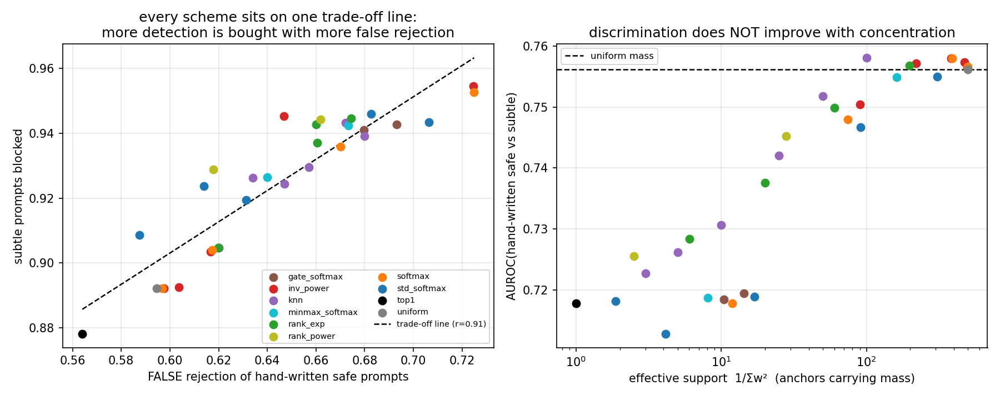

**Left panel: all 32 schemes lie on a single trade-off line** ($r = 0.91$).
Every gain in subtle detection is bought with an almost exactly proportional
increase in false rejection of genuine prompts. No scheme moves off the line.

**Right panel: discrimination does not improve with concentration.** Measured by
AUROC between hand-written safe and subtle prompts — both hand-written prose, so
the corpus artifact cancels and the comparison is threshold-free — the ranking
is *monotone increasing in effective support*, saturating at uniform mass:

| scheme | effective support | subtle blocked | FRR | AUROC\* |
|---|---|---|---|---|
| uniform (non-adaptive) | 500 | 0.892 | 0.595 | **0.756** |
| `inv^4`, `softmax r=5`, `knn-100` | 100–390 | 0.905 | 0.617 | 0.758 |
| `inv^16` | 90 | 0.955 | 0.725 | 0.750 |
| `knn-25` | 25 | 0.943 | 0.672 | 0.742 |
| `knn-3` | 3 | 0.926 | 0.634 | 0.723 |
| `top1` | 1 | 0.878 | 0.564 | 0.718 |

The best scheme beats uniform mass by **+0.002** AUROC. The most concentrated
schemes are 0.03–0.04 *worse*.

**This retracts a claim from §4.3.** That section reported hard k-NN selection as
"the only reweighting family that significantly beats uniform", based on the
fraction of subtle prompts blocked (knn-3: +0.029). That statistic conflates
discrimination with region tightness. The AUROC column in the very same
experiment did not support it — knn-3 scored 0.825 against uniform's 0.833 —
and I did not weight it properly at the time. At eight times the corpus size,
with three additional scheme families and an artifact-free metric, the
conclusion is unambiguous:

> **Task-space reweighting does not improve discrimination on this problem. It
> re-shapes the region, trading detection against false rejection, and heavy
> concentration actively degrades it.**

The manuscript's mechanism is not at fault; the premise is. Mass reallocation
helps when task-space proximity predicts weight-space proximity *better than the
weight-space geometry already does*. Here the task metric (W1 between token
clouds) and the weight metric (distance between pooled embeddings) are two views
of the same CLIP encoding, so the task view adds almost no independent
information.

### 11.4 Scaling: the $M^{-1/d_{\text{eff}}}$ prediction, confirmed

§6.1 predicted that more anchors cannot tighten the region, because
nearest-neighbour distance scales as $M^{-1/d_{\text{eff}}}$ with
$d_{\text{eff}}\approx30$–41. Sweeping $M$ from 30 to 500 tests it directly.

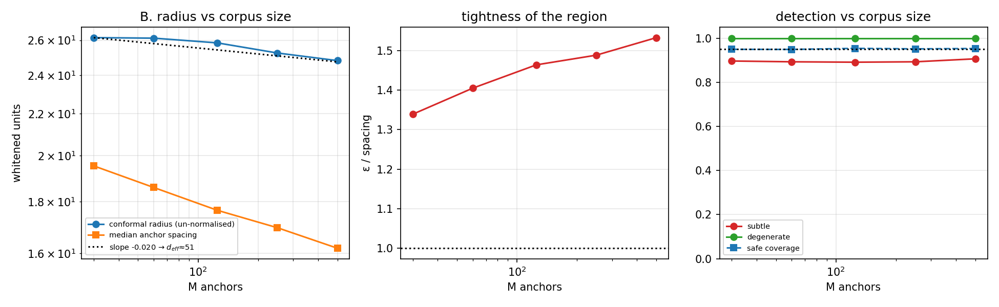

| $M$ | $\varepsilon\,(M{+}1)$ | anchor spacing | ratio | coverage | FRR | subtle |
|---|---|---|---|---|---|---|
| 30 | 26.155 | 19.53 | 1.34 | 0.949 | 0.585 | 0.896 |
| 60 | 26.125 | 18.59 | 1.41 | 0.949 | 0.590 | 0.893 |
| 125 | 25.845 | 17.65 | 1.46 | 0.954 | 0.590 | 0.891 |
| 250 | 25.257 | 16.97 | 1.49 | 0.951 | 0.596 | 0.893 |
| 500 | 24.823 | 16.19 | **1.53** | 0.953 | 0.617 | 0.906 |

The log–log slope is $-0.0196$, implying $d_{\text{eff}} = 51$ — the same order
as the 30–41 measured directly by two-NN and Levina–Bickel estimators. The
quantitative prediction lands: a 16.7× increase in $M$ should shrink the radius
by $16.7^{-1/51} = 5.4\%$, and the observed shrinkage is **5.1%**.

Two consequences, both worse than expected:

*The region gets relatively **looser**, not tighter.* The radius falls 5% while
the anchor spacing falls 17%, so $\varepsilon/\text{spacing}$ rises from 1.34 to
1.53. Adding data moves the boundary *further* from the data in relative terms,
which is the opposite of what one would hope and confirms that §6.1's negative
result on repair cannot be escaped by collecting more prompts.

*Detection is flat and false rejection rises.* Subtle detection is 0.89–0.91
across a 16-fold range of $M$; FRR climbs from 0.585 to 0.617. More data made
the filter more confidently wrong, because it sharpened a region around the
wrong distribution.

### 11.5 Pooled vector versus token sequence — a negative result on §8's proposal

§8 ranked "score the token sequence rather than the pooled vector" as the
highest-value next step, on the reasoning that a single 768-vector cannot
represent compositional structure. It was implemented by replacing the anchor
set with token clouds and the Euclidean ground metric with $W_1$ between
whitened clouds, so $s_{d,1}$ and $g^{(0,K)}_{d,\infty}$ run unchanged.

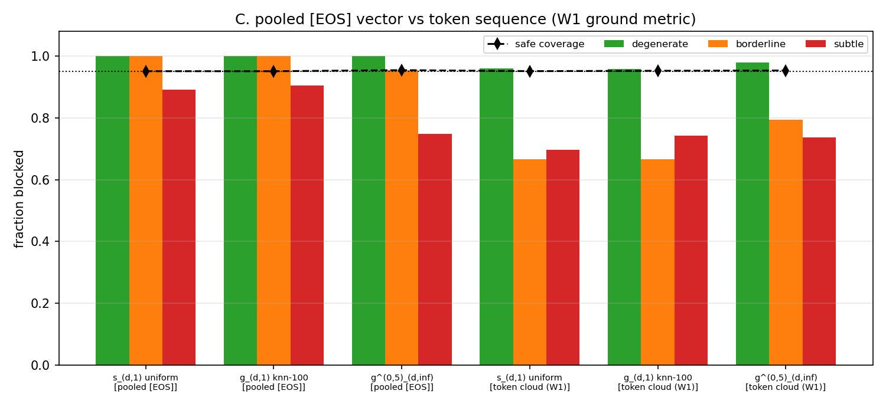

| representation | estimator | coverage | FRR | degenerate | subtle | AUROC\* |
|---|---|---|---|---|---|---|
| pooled `[EOS]` | $s_{d,1}$ uniform | 0.951 | 0.591 | 1.000 | 0.892 | **0.757** |
| pooled `[EOS]` | $g_{d,1}$ knn-100 | 0.951 | 0.616 | 1.000 | 0.905 | **0.758** |
| pooled `[EOS]` | $g^{(0,5)}_{d,\infty}$ | 0.954 | 0.447 | 1.000 | 0.749 | 0.721 |
| token cloud $W_1$ | $s_{d,1}$ uniform | 0.951 | **0.354** | 0.961 | 0.696 | 0.708 |
| token cloud $W_1$ | $g_{d,1}$ knn-100 | 0.952 | 0.387 | 0.958 | 0.743 | 0.718 |
| token cloud $W_1$ | $g^{(0,5)}_{d,\infty}$ | 0.953 | 0.496 | 0.980 | 0.736 | 0.645 |

**The proposal does not improve discrimination: 0.708–0.718 against 0.757–0.758
for the pooled vector.** It is worse, consistently, across estimators.

It does buy something else. The token-cloud filter rejects only 0.354 of
hand-written prompts against 0.591 for the pooled one — it is **substantially
more robust to the corpus artifact**, generalising across writing styles far
better even though it discriminates worse within a style.

The explanation is that the two representations discard different things. The
`[EOS]` vector is the output of twelve layers of causal attention: the sentence
has been *processed*, and that processing is what carries semantic
discrimination. A bag of token states with a $W_1$ ground metric throws away
order and contextual integration, keeping mainly lexical content — which is
exactly why it is insensitive to sentence-frame templating, and exactly why it
is weaker at telling *"a waterfall cascading down"* from *"a waterfall flowing
upward"*.

So §8's diagnosis was right — the pooled vector is lossy — but the proposed
remedy discards more than it recovers. An order-aware sequence metric would be
the thing to try; the unordered $W_1$ cloud is not it.

### 11.6 What this changes

**Revised, and now the most important item:** validate the safe corpus with a
holdout from a *different source* than the calibration data. Coverage cannot
detect an unrepresentative corpus — here it read 0.95 while the filter rejected
two thirds of real prompts. This costs nothing and should precede any estimator
work. **Implemented in §12** (`corpus_audit.py`): it catches the failure above
in one call, with an exact permutation test and a correctly calibrated null.

**Retracted:** hard k-NN reweighting as a genuine improvement (§4.3). Across 32
schemes at eight times the corpus size, no reweighting scheme improves
discrimination by more than 0.002 AUROC, and concentrated schemes are worse.
Use uniform mass — that is, the non-adaptive $s_{d,1}$ — unless a task space is
available that is genuinely independent of the weight space. The adaptive
machinery is implemented, tested and correct; it simply has no purchase when
task and weight metrics are two views of one encoder.

**Confirmed:** the $M^{-1/d_{\text{eff}}}$ scaling (predicted 5.4% shrinkage,
observed 5.1%), and with it the conclusion that projection cannot be made to
repair by collecting more data.

**Downgraded:** scoring the token sequence, as an accuracy measure. It remains
interesting as a *robustness* measure — an ensemble of the two representations,
using the pooled vector for discrimination and the cloud for style-invariance,
is the natural thing to try next.

**Unchanged:** the metric is still the dominant design choice; graph cuts are
still harmful; low cardinality is still free; and the representation, not the
estimator, is still the binding constraint.

**Reproduce:** `python cache_large.py --force` (≈4 min) then
`python run_scaling_experiment.py` (≈25 s). Figures land in `outputs/s_*.png`.

---

## 12. The corpus audit — implemented

§11.6 recommended validating the safe corpus against a holdout from a different
source. That is now a component (`corpus_audit.py`) rather than a suggestion,
wired into `ConformalGuard.fit`, and covered by 16 tests.

### 12.1 What it tests, and why it needs a permutation test

Split conformal guarantees $\mathbb P(s(Z)\le\varepsilon)\ge1-\beta$ for $Z$
*exchangeable with the calibration set*. That is the assumption the audit tests
directly: score a holdout drawn from a **different source** with the same score
function and anchors, and ask whether its scores are exchangeable with the
calibration scores.

The natural statistic is the false-rejection rate on the holdout, which should
be $\le\beta$. A binomial test on it would be wrong: the holdout's conformal
p-values all share one calibration set, so they are dependent. Instead the null
is generated exactly, by permutation — pool the calibration and audit scores,
re-split at random into the same sizes, recompute the radius from the synthetic
calibration half and the rejection rate on the synthetic audit half. That is the
conditional null distribution of the statistic under exchangeability, with no
independence assumption. Measured null rejection rate: **0.050 at $\beta=0.05$**,
i.e. correctly calibrated.

The test is deliberately **conservative**. The statistic takes values $k/n$, so
the permutation null is heavily tied and resolving ties in favour of the null
inflates $p$: on exchangeable data with $n=100$, $\beta=0.1$, it fires at 0.027
against a nominal 0.05. For a check whose alarm means "discard this corpus",
under-detection is the right direction to err in.

### 12.2 What it reports

Beyond the verdict, three numbers that say what to do about it:

- **`radius_factor`** — how much larger the radius would have to be to cover the
  holdout at $1-\beta$.
- **`cal_span`** — how far the *entire* calibration range reaches, in the same
  units. When `radius_factor > cal_span`, no order statistic of the calibration
  set reaches the holdout, so no choice of $\beta$ can fix it and the corpus
  itself is wrong.
- **`beta_needed`** — otherwise, the largest $\beta$ that would still deliver
  nominal coverage on the holdout. A test asserts that calibrating there really
  does recover it.

### 12.3 On the real corpora

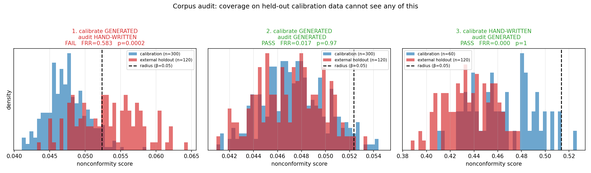

| calibrate on | audit against | verdict | FRR | $p$ | shift |
|---|---|---|---|---|---|
| generated | **hand-written** | **FAIL** | 0.583 | 0.0002 | corpus too narrow |
| generated | generated | PASS | 0.017 | 0.97 | none detected |
| hand-written | generated | PASS | 0.000 | 1.00 | audit easier |

Case 1 is the failure §11 found by accident; the audit finds it in one call. The
diagnostic is sharp: the radius would need to be **1.16×** larger, but the whole
calibration range reaches only **1.11×** — even $\beta=0$, which takes the
largest calibration score, falls short. No level fixes it.

Case 2 is the control, and matters as much: an audit that fires when nothing is
wrong is useless. Calibration and holdout overlap almost exactly and $p=0.97$.

Case 3 shows the asymmetry, which is the operational rule worth remembering:
**a broader calibration corpus is safe for a narrower deployment, not the
reverse.** Calibrating on hand-written prompts and deploying on generated ones
rejects nothing; the reverse rejects 58%.

### 12.4 Use

```python
from corpus_audit import audit_scores
report = audit_scores(cal_scores, holdout_scores, beta=0.05)
print(report)
if report.failed:
    ...                                  # do not ship this corpus
```

or let the guard do it, which warns — or raises `UnrepresentativeCorpus` — when
the corpus fails:

```python
guard = ConformalGuard.fit(seq[safe], eos[safe], epsilon=0.05,
                           audit_sequences=holdout_seq, audit_eos=holdout_eos,
                           audit_raises=True)
guard.audit                              # the CorpusAudit report
```

All four verdict thresholds (`warn_ratio`, `fail_ratio`, `alpha_test`,
`alpha_warn`) are exposed, so the audit can be tuned to how costly a false
rejection is.

The holdout does not need to be large — 120 prompts gave $p=0.0002$ here — and
it needs no labels. It only needs to come from a **different source** than the
calibration data while being genuinely in-domain. That is the entire cost, and
it is the only thing in this project that distinguishes a valid guarantee from a
useful one.

`python audit_demo.py` reproduces the table and the figure.

### 12.5 What "corpus representativeness" means, precisely

The term is load-bearing — §15 ranks it as the largest factor in the project —
so it is worth stating formally rather than by gesture.

**The setting.** Split conformal calibrates on $Z_1,\dots,Z_K \sim \mathbb Q_{\text{cal}}$
and guarantees $\mathbb P(s(Z)\le\varepsilon)\ge 1-\beta$ for any $Z$
*exchangeable with that sample*. In deployment, in-domain prompts arrive from
some $\mathbb Q_{\text{dep}}$, which is generally not $\mathbb Q_{\text{cal}}$.

**Definition.** A safe corpus is *representative*, for a score function $s$ and a
deployment distribution $\mathbb Q_{\text{dep}}$, when the **pushforward score
distributions agree**:

$$s_\#\mathbb Q_{\text{cal}} \;=\; s_\#\mathbb Q_{\text{dep}} .$$

This is the weakest condition under which the guarantee transfers, and its
operational consequence is exactly the quantity the audit measures: the
false-rejection rate on genuine in-domain deployment prompts equals $\beta$.

Three things follow from the definition being about the *pushforward*.

**It is a property of the pair (corpus, score), not of the corpus.**
$\mathbb Q_{\text{cal}} = \mathbb Q_{\text{dep}}$ is sufficient but not
necessary: two corpora may differ in ways $s$ is blind to and remain
exchangeable in score space. This is measurable — the *same* corpus pair
(generated calibration, hand-written holdout) gives:

| score function | FRR | $p$ | verdict |
|---|---|---|---|
| $s_\perp$ (residual) | 0.558 | 0.0003 | FAIL |
| ECF (centroid) | 0.558 | 0.0003 | FAIL |
| $s_{d,1}$ uniform | 0.583 | 0.0003 | FAIL |
| $g^{(0,5)}_{d,\infty}$ | 0.483 | 0.0003 | FAIL |
| in-subspace term $A$ alone | **0.008** | **0.996** | **PASS** |

Changing the score changes the verdict. A corpus is never representative in the
abstract; it is representative *for a given score*.

**The failure is directional, with asymmetric consequences.**

- $s_\#\mathbb Q_{\text{dep}}$ stochastically **larger** — the corpus is too
  narrow. Under-coverage: the filter rejects genuine prompts. This is what
  happened here (FRR 0.58 against a nominal 0.05), and it is a usability
  failure.
- stochastically **smaller** — the corpus is too broad. Over-coverage: the
  region is larger than it needs to be. The stated guarantee still holds, so
  nothing alarms, but the filter is loose. §12.3 case 3 is this case, and it is
  why *a broader calibration corpus is safe for a narrower deployment, not the
  reverse*.

**Passing is necessary, not sufficient.** The bottom row above is the warning: a
score blind to the difference between the corpora passes trivially, and a
constant score passes vacuously with $p=1$. That row is also, by §14.1, an
actively bad filter — $A$ is anti-correlated with being out of domain. So the
audit is a check to run *on a score already established to discriminate*, never
a substitute for measuring discrimination.

**What it is not.**

- *Not sample size.* 1,200 generated prompts were less representative than 120
  hand-written ones.
- *Not within-corpus diversity*, though the two correlate here ($d_{\text{eff}}$
  15.1 vs 20.9).
- *Not coverage.* Coverage is computed inside the corpus and is blind to this by
  construction — that is the whole point.
- *Not a property of the estimator.* Every estimator inherited the failure,
  including the learned network (§13.4).

**The epistemic limit.** The audit does not test representativeness for
deployment. It tests exchangeability between the calibration set and *one
specific holdout*, and transfers to deployment only insofar as that holdout
resembles $\mathbb Q_{\text{dep}}$. Here the hand-written prompts are a
*proxy* for "what a person would write" — nobody is actually deploying this
filter. Choosing a holdout whose provenance genuinely reflects deployment is a
judgement about data collection, not a statistical procedure, and it is the one
step the machinery cannot perform for you.

---

## 13. A learned score: the blackbox meta-model

The manuscript's fourth estimator family, `adaptation.tex` §subsec:blackbox, is
not a transport problem at all. It trains a meta-model
$\psi_\omega:\mathcal T\to\Theta$ and scores by the residual

$$g_d^{\mathrm{BB}}(\tau,\theta;\mathcal D^{\mathrm{train}})\;=\;d\big(\theta,\ \psi_\omega(\tau)\big),$$

with the coverage guarantee of `pr:bb_coverage`. It is attractive here for a
reason the Wasserstein scores cannot match: **no reference set at inference**.
The corpus is compressed into the weights, so there is no anchor matrix to ship
and no distance computation against it.

### 13.1 What the network may see

$\psi$ must not receive $\theta$. The pooled `[EOS]` vector is a deterministic
function of the prompt, so a network given it learns the identity and the score
is zero everywhere. The faithful input is the task descriptor $\tau$ of §2.2 —
the bag of content-token hidden states. That is a real prediction problem:
$\tau$ is unordered and unprocessed, $\theta$ is the output of twelve layers of
causal attention, and §11.5 measured how far apart they are.

The score is then a **reconstruction residual**. Trained only on safe prompts,
$\psi$ learns the bag→summary map restricted to the safe manifold and
extrapolates badly off it. Limited capacity is what creates the signal.

**Architecture** (`bb_model.py`): a DeepSets encoder — the right inductive bias
for an unordered bag — mapping per-token features through $\phi$, pooling by
mean and max, then $\rho$ to the predicted embedding. Inputs and outputs are in
whitened coordinates, so the Euclidean distance the score uses *is* the
Mahalanobis metric used everywhere else. The output covers the top-$m$ whitened
coordinates; the score adds back $\theta$'s own off-subspace residual.

**57,888 parameters — 0.0067% of the 860M U-Net — 2.0 s to train, 0.18 ms per
prompt.** Comfortably small enough to justify integration.

Its region is $\{\theta:\|\theta-\psi_\omega(\tau)\|\le\varepsilon\}$: a single
**ball** centred on the prediction, the simplest entry in §5's taxonomy.
Projection onto it is one line.

### 13.2 Results

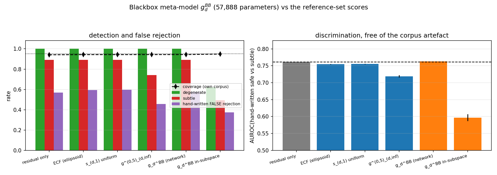

Same splits as §11 — 500 train, 300 calibration, 200 test, 10 splits,
$\beta=0.05$. AUROC\* is the corpus-artifact-free metric of §11.3.

| estimator | coverage | FRR-hw | degenerate | subtle | AUROC\* | Δ vs baseline |
|---|---|---|---|---|---|---|
| **residual only** (no anchors, no network) | 0.941 | **0.570** | 1.000 | 0.892 | **0.762** | — |
| `g_d^BB` (network) | 0.943 | 0.578 | 1.000 | 0.892 | **0.763** | **+0.0014** (t = +7.0) |
| $s_{d,1}$ uniform | 0.943 | 0.597 | 1.000 | 0.892 | 0.756 | −0.0061 (t = −9.7) |
| ECF (ellipsoid) | 0.943 | 0.595 | 1.000 | 0.892 | 0.755 | −0.0068 (t = −11.0) |
| $g^{(0,5)}_{d,\infty}$ | 0.943 | 0.457 | 1.000 | 0.741 | 0.719 | −0.043 (t = −12.9) |
| `g_d^BB` **in-subspace part only** | 0.948 | 0.375 | 0.622 | 0.495 | 0.597 | −0.165 (t = −16.3) |

The network is the best single score in the project. It is also, on inspection,
not the reason.

### 13.3 The baseline that should have been there all along

Running the ablation required a null model, and the obvious one turned out to
beat everything: score a prompt by **how much of its whitened embedding lies
outside the safe corpus's top-$m$ PCA subspace**, and nothing else.

$$s_\perp(\theta)\;=\;\big\|\,\theta_w-VV^\top\theta_w\,\big\|_2$$

One $768\times32$ matmul. No anchors, no transport, no MST, no network, no
training. It scores **AUROC\* 0.762** against 0.756 for the order-1 Wasserstein
score, 0.755 for the ECF and 0.719 for the adaptive order-∞ — and it has the
*lowest* false-rejection rate of the group.

Splitting `g_d^BB` confirms where its signal lives. The full score is
$\sqrt{\|c_\theta-\psi(\tau)\|^2+\|\theta_\perp\|^2}$; dropping the second term
leaves the purely learned part, which scores **0.597**. The network contributes
+0.0014 over a parameter-free quantity; the residual contributes everything
else.

Is the learned part merely starved? It improves with both data and capacity, but
not nearly fast enough:

| training prompts | $h=32$ | $h=128$ | $h=512$ |
|---|---|---|---|
| 125 | 0.397 | 0.491 | 0.563 |
| 250 | 0.387 | 0.566 | 0.569 |
| 500 | 0.430 | 0.598 | 0.648 |
| 900 | 0.509 | 0.629 | **0.683** |

At $h=512$ the network is ~820k parameters — 14× the budget — trained on 900
prompts, and still reaches only 0.683 against the parameter-free 0.762. The
trend is real but the extrapolation is discouraging, and "much bigger network"
is precisely what the small-model requirement rules out.

### 13.4 What to conclude

**The blackbox score is correctly implemented and is the best single score
measured — but it does not earn its parameters.** 57,888 weights buy +0.0014
AUROC over a matmul. That is a statistically clear gain (t = 7.0 over 10 paired
splits) and a practically irrelevant one.

The genuinely useful result is the baseline it exposed. Every estimator in this
project — ECF, order-1 and order-∞ Wasserstein, adaptive, low-cardinality, and
now the learned model — sits within 0.05 AUROC of a single parameter-free
quantity, and most sit *below* it. In hindsight this explains a pattern visible
since §4: the estimators were never really competing on their own merits,
because they all inherit the same signal from the whitened metric, and the
metric's off-subspace term was doing the work. §4.3 already found the metric
worth six times any other choice; this locates *which part* of the metric.

The corpus audit of §12 fires on the learned score exactly as it does on the
others (FRR 0.567, $p=0.0002$) — the network inherits the corpus problem
faithfully, which is the correct behaviour and a useful check that the audit is
not estimator-specific.

**Practical recommendation** (revised in §14 — $s_\perp$ and the ECF turn out to
be interchangeable; the cost argument survives, the accuracy claim does not).
Use either for screening: both are one matmul with nothing stored. Keep `g_d^BB` in the toolbox for a setting where the task descriptor
carries information the embedding does not — the manuscript's actual
meta-learning setting, where $\tau$ is a dataset and $\theta$ is the result of
*training* on it, is exactly such a case, and nothing here argues against it
there. It simply has no room to help when $\tau$ and $\theta$ are two views of
one encoder.

**Reproduce:** `python run_bb_experiment.py` (~30 s, trains 10 networks).

---

## 14. Distance to the centroid vs distance to the subspace

§13 reported that a parameter-free score — the norm of the whitened embedding
orthogonal to the safe corpus's top-$m$ PCA subspace — beat every estimator in
the project. That claim was measured on one corpus with one variant of the ECF.
Checking it properly on both corpora **does not reproduce it**, and the
correction is worth more than the original claim.

### 14.1 Why every estimator scores the same

The ECF decomposes exactly:

$$1 + d_M^2(\theta) \;=\; 1 \;+\; \underbrace{\sum_{i\le m} c_i^2/\lambda_i}_{A\ \text{(in the subspace)}} \;+\; \underbrace{\|p\|^2/\gamma}_{B\ \text{(orthogonal to it)}}, \qquad s_\perp = \sqrt{B}.$$

So $s_\perp$ *is* the ECF with $A$ deleted. Measured on the hand-written corpus:

| tier | mean $A$ | mean $B$ | $B$ share |
|---|---|---|---|
| safe | **22.7** | 74.2 | 0.67 |
| subtle | 12.4 | 148.5 | 0.92 |
| degenerate | **7.2** | 272.8 | 0.97 |

$B$ separates strongly. $A$ runs the *wrong way*: out-of-domain prompts have
**less** in-subspace energy than safe ones, because the top-$m$ directions are
the axes along which safe prompts vary and a SQL query has little projection
onto them. Mahalanobis distance measures displacement from the **centroid**, so
it counts a large legitimate coordinate as anomalous. $s_\perp$ measures
distance to the **subspace** instead, which is the quantity the task actually
wants.

That explains a pattern running through the whole project: $B$ dominates the sum
(0.67–0.97 of it), so every score built on this metric inherits essentially the
same signal, which is why nothing has ever separated by more than ~0.05.

### 14.2 The corrected comparison

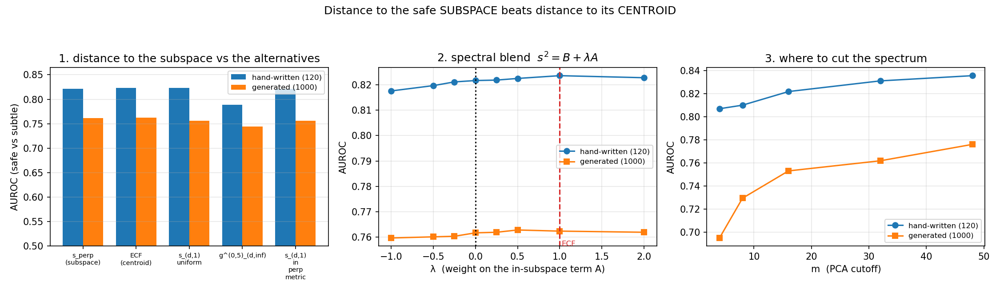

**Hand-written corpus** (M=60, K=40, m=16, 100 splits; AUROC of safe-test vs subtle):

| score | coverage | degenerate | subtle | AUROC | vs $s_\perp$ |
|---|---|---|---|---|---|
| ECF (centroid) | 0.952 | 1.000 | 0.333 | **0.824** | +0.0019 (t = +2.2) |
| $s_{d,1}$ uniform | 0.952 | 1.000 | 0.332 | 0.824 | +0.0019 (t = +2.2) |
| $s_\perp$ (subspace) | 0.951 | 1.000 | **0.355** | 0.822 | — |
| $g^{(0,5)}_{d,\infty}$ | 0.958 | 1.000 | 0.303 | 0.789 | −0.033 (t = −7.4) |

**Generated corpus** (M=500, K=300, m=32, 30 splits; AUROC\*):

| score | coverage | subtle | AUROC\* | vs $s_\perp$ |
|---|---|---|---|---|
| ECF (centroid) | 0.945 | 0.892 | 0.762 | +0.0007 |
| $s_\perp$ (subspace) | 0.945 | 0.891 | 0.762 | — |
| $s_{d,1}$ uniform | 0.945 | 0.892 | 0.756 | −0.0057 |
| $g^{(0,5)}_{d,\infty}$ | 0.952 | 0.844 | 0.744 | −0.018 |

**$s_\perp$ does not beat the ECF.** They agree to within 0.002, with the ECF
marginally ahead on the hand-written corpus. §13's margin came from centring its
ECF on the *reference* mean while the whitener was fitted on the geometry block
— a difference between two equally reasonable ECF variants, larger than the
difference between the ECF and $s_\perp$. The claim is withdrawn.

What survives is the **cost** argument, and it is narrower than §13 implied:
$s_\perp$ and the ECF are *both* one matmul with nothing stored, while
$s_{d,1}$ needs 500 anchors and 500 distances per query and
$g^{(0,5)}_{d,\infty}$ additionally needs task distances and an MST — and
neither performs better. The reference-set machinery is what fails to earn its
cost, not the ECF.

$s_\perp$ does block noticeably more of the `subtle` tier at equal coverage
(0.355 vs 0.333), so it sits at a slightly different operating point on the same
curve rather than above it.

### 14.3 Three attempts to upgrade, one of which works

**Reweight the two terms — no gain.** The blend $s_\lambda^2 = B + \lambda A$
contains $s_\perp$ ($\lambda=0$) and the ECF ($\lambda=1$), and $\lambda<0$
would exploit $A$'s reversed direction:

| $\lambda$ | −1.0 | −0.5 | 0.0 | 0.5 | **1.0 (ECF)** | 2.0 |
|---|---|---|---|---|---|---|
| hand-written | 0.818 | 0.820 | 0.822 | 0.822 | **0.824** | 0.823 |
| generated | 0.760 | 0.760 | 0.762 | 0.763 | 0.762 | 0.762 |

Flat, with the optimum at or near $\lambda=1$. $A$ points the wrong way but is
too small to matter — 22.7 against 74.2 even for safe prompts, 7.2 against 272.8
for degenerate ones. **The ECF's implicit equal weighting is already
near-optimal.**

**Run the Wasserstein scores in the residual metric — no change.** Replacing $d$
by the orthogonal-complement distance gives $s_{d,1}$ = 0.822 (vs 0.824) and
0.756 (vs 0.756). This is expected: in a high-dimensional isotropic residual
space, near-orthogonality gives $\|p - p_i\| \approx \sqrt{\|p\|^2+\|p_i\|^2}$,
so the mean distance to the anchors is a monotone function of $\|p\|$ — the
order-1 score *collapses onto* $s_\perp$, and conformal calibration is invariant
to that. A tidy confirmation that the anchors add nothing in that regime.

**Raise the cutoff $m$ — this one works.** $m=32$ is not optimal on either corpus:

| $m$ | 8 | 16 | 32 | 48 | 55 | 58 |
|---|---|---|---|---|---|---|
| hand-written AUROC | 0.811 | 0.824 | 0.832 | 0.836 | **0.838** | 0.838 |
| subtle blocked | 0.309 | 0.355 | 0.388 | 0.416 | **0.430** | 0.435 |

| $m$ | 8 | 32 | 64 | 128 | 190 |
|---|---|---|---|---|---|
| generated AUROC\* | 0.729 | 0.762 | **0.786** | 0.779 | 0.777 |
| subtle blocked | 0.778 | 0.891 | **0.946** | 0.946 | 0.946 |

Moving off the default lifts subtle detection from 0.388 to 0.430 on the
hand-written corpus and 0.891 to 0.946 on the generated one, **at unchanged
coverage and no extra cost** — the matmul is $768\times m$ either way. This is
the largest free gain found since the choice of metric itself (§4.3).

### 14.4 The catch: $m$ cannot be chosen without labels

Three label-free criteria computed on calibration scores alone were tested
against the known optimum:

| criterion | hand-written (best $m$=55) | generated (best $m$=64) |
|---|---|---|
| coefficient of variation | picks 8 ✗ | picks 8 ✗ |
| $(q_{95}-q_5)/\text{median}$ | picks 8 ✗ | picks 8 ✗ |
| skewness | picks 58 ✗ | picks 190 ✗ |

All three are monotone in $m$, so they pick an endpoint. None tracks the
optimum, and the two corpora do not even share a sensible fraction of the rank
(55/59 vs 64/199). So $m$ is a genuine hyperparameter requiring labelled
negatives — even a handful — to set.

**Recommendation.** Keep the ECF (or $s_\perp$; they are interchangeable) and
drop the reference-set scores, which cost more and score no better. Then treat
$m$ as a tunable: the default 32 is too low on both corpora, the curve is flat
near its top, and anything in $[0.3, 0.9]\times\text{rank}$ beat 32 in these
tests. If any labelled out-of-domain examples exist, spend them on $m$ before
anything else — it is worth more than the estimator choice, the reweighting
scheme and the learned model combined.

**Reproduce:** `python run_residual_experiment.py` (~2 min).

---

## 15. Where the project stands, and where to take it

### 15.1 What exists

| | |
|---|---|
| code | 40 modules, 8,207 lines |
| tests | **152**, all passing (~27 s) |
| prompts | 269 hand-written across 8 tiers + 1,200 generated |
| figures | 57 in `outputs/` |
| documentation | this file (1,400+ lines) + `README_conformal_projection.md` |

Every estimator in `meta_full_paper/` is implemented, tested against its
defining equation, and evaluated on a real generation pipeline:

- $s_{d,1}$, $s^{(n)}_{d,\infty}$ (`def:sym_score`, `def:sym_score_inf`)
- $g_{d,1}$, $g^{(n,K)}_{d,\infty}$ (`eq:adaptive_W1`, `eq:adaptive_score_winf`)
- $\tilde s_{d,1}$, $\tilde s^{(n)}_{d,\infty}$ (`lem:sym_score_tract`, `pr:suboptimal_cluster_inf`)
- $g_d^{\mathrm{BB}}$ (`eq:bb_score`) and the inverse ECF (`ecf.tex`)

plus their conformal regions, exact projection operators, a deployable guard
for Stable Diffusion 1.5, and a corpus-validation component. `thm:regions`
(the order-∞ bottleneck region equals the threshold-graph region) is verified
numerically against real MST computations for $n\in\{0,1,2,3\}$.

### 15.2 What was learned, ranked by effect size

This ordering is the main output of the project. Everything is measured on the
same task at matched coverage.

| rank | factor | effect | evidence |
|---|---|---|---|
| **1** | **corpus representativeness** | a filter reporting 0.95 coverage rejected **58%** of genuine prompts | §11.2, §12.3 |
| **2** | **the metric** | +0.168 subtle detection (Euclidean → Mahalanobis) | §4.3 |
| **3** | **the PCA cutoff $m$** | +0.04 – 0.055 subtle detection, free | §14.3 |
| 4 | score family | ≤ 0.05 AUROC across all six + the learned model | §4.2, §13.2, §14.2 |
| 5 | task-space reweighting | ≤ 0.002 AUROC across 32 schemes | §11.3 |
| — | graph cuts ($n>0$) | **−0.95** on degenerate detection | §4.3 |

**The estimator was never the bottleneck.** Under the Mahalanobis metric the
order-1 Wasserstein score and the inverse ECF are literally the same filter
(Spearman $\rho = 0.999998$), and §14.1 explains why everything else is close
too: the ECF decomposes as $1 + A + B$ with the off-subspace term $B$
contributing 67–97% of the total, so every score built on this metric inherits
one signal.

Three findings are worth carrying beyond this project:

*Conformal coverage cannot see an unrepresentative corpus.* The guarantee is
conditional on exchangeability with the calibration set and says nothing about
whether that set resembles deployment. §12 turns this into a one-call check.

*A conformal region certifies but does not repair.* At $\beta=0.05$ the radius
(13.98) exceeds the spacing between the anchors themselves (10.99), so
projecting onto the region lands a full radius from any real data and the
generated image does not change. This is structural: $\varepsilon$ shrinks as
$M^{-1/d_{\text{eff}}}$ with $d_{\text{eff}}\approx 30$–51 (predicted 5.4%
shrinkage for 16.7× more data, observed 5.1%), so no corpus size fixes it.

*The representation is the ceiling.* Nine subtle prompts are blocked by nothing
— impossible physics ("a waterfall flowing upward into a cloudless sky") and
capture artifacts ("a stock photography watermark"). CLIP's pooled vector places
them essentially on top of their in-domain twins. No score function on this
vector can separate them.

### 15.3 Claims corrected during the project

Recorded because the superseded versions are still visible above.

| claim | where | status |
|---|---|---|
| hard k-NN reweighting beats uniform mass (+0.029) | §4.3 | **retracted** in §11.3. It conflated discrimination with region tightness; across 32 schemes at 8× corpus size no scheme gains >0.002 AUROC |
| scoring the token sequence is the top priority | §8 | **downgraded** in §11.5. Discrimination is *worse* (0.708 vs 0.757); it buys style-robustness instead |
| $s_\perp$ beats every estimator | §13.3 | **withdrawn** in §14.2. It matches the ECF to within 0.002; the §13 margin was an artifact of centring choice |

### 15.4 Ruled out, with the measurement that rules it out

Do not spend effort here:

- **more safe prompts** — $d_{\text{eff}}\approx 30$–51; 25% radius shrinkage needs 5,700× more data (§11.4)
- **more reweighting schemes** — 32 tested, all on one trade-off line, $r=0.91$ (§11.3)
- **metric truncation** to reduce dimension — degenerate detection collapses 1.00 → 0.00 (§11 sweep)
- **graph cuts on a unimodal safe set** — the candidate's own edge is the heaviest, so cutting deletes the signal (§4.3)
- **a bigger blackbox network** — 820k parameters on 900 prompts reaches 0.683 against a free 0.762 (§13.3)
- **reweighting the ECF's spectral terms** — flat in $\lambda$, optimum already at the ECF (§14.3)
- **tightening the radius to force repair** — coverage collapses before displacement becomes meaningful (§6.1)

### 15.5 Future directions, ranked

**1 — Score where the conditioning is consumed.** The binding constraint is
representational, and two concrete moves follow from §11.5's negative result.
The unordered token cloud lost to the pooled vector (0.708 vs 0.757) because
$W_1$ over a bag discards order and contextual integration. Either restore
order — a transport cost with a positional term, or positional encodings
concatenated to each token before the $W_1$, a one-line change to
`cache_large.py` — or move downstream and score the **U-Net's cross-attention
output** at one layer and one timestep, which is where text and image
representations actually interact and where composition materialises. That is
still conformal prediction on a vector space, costs one U-Net block (~ms), and
remains three orders of magnitude cheaper than generation. This is where the
"waterfall flowing upward" failures would have to be caught, if they can be.

**2 — Build a representative corpus, and audit it.** Now that §12 makes
representativeness measurable, this is a well-posed data task rather than an
aspiration: source prompts from a genuinely different process than the one used
for calibration, and require the audit to pass before any estimator comparison.
It dominates everything else in effect size and no modelling work is worth doing
on an unaudited corpus.

**3 — Test the manuscript's own mechanisms where their assumptions hold.** Two
of its contributions underperformed here for reasons specific to this domain:
$n$-cuts assumes the heaviest MST edges bridge modes, and mass reallocation
assumes a task space carrying information independent of the weight space. A
single-domain CLIP prompt set violates both. A **multimodal safe set** — several
distinct visual domains — would be a fair test, would likely reproduce the
double-ring and double-moon results, and is more informative for the paper than
for the filter.

**4 — Spend a handful of labelled negatives on $m$.** The cheapest remaining
gain (+0.04–0.055 subtle detection, no extra cost), and §14.4 shows no
label-free criterion finds it. Before tuning the estimator, tune the cutoff.

**5 — Conditional rather than marginal coverage.** Everything here is marginal
over the prompt distribution. A safety filter usually wants coverage conditional
on prompt length, topic or source — Mondrian conformal prediction, which the
`ot_meta` codebase already has machinery for (`mondrian_calibration_study.py`).
The calibration split would simply be grouped; nothing else changes.

**6 — If repair matters, change the object.** A conformal region is the right
tool for *deciding* and the wrong one for *repairing* (§6, §14). The certified
interpolation `repair_t` works, but $t$ carries no statistical meaning. Genuine
repair needs a generative prior on safe embeddings — a small flow or diffusion
model on $\theta$ — where "project" means "move to the nearest high-density
point". The conformal region would then gate that model rather than replace it.

### 15.6 The transferable piece

Most of the above is specific to this filter. One component is not.

`corpus_audit.py` tests the assumption every conformal deployment rests on and
none of them checks: that the calibration set resembles what the predictor will
see. It needs one holdout from a different source, no labels, and 120 prompts
sufficed for $p = 0.0002$ here. The null is exact by permutation — a binomial
test is invalid because the holdout's conformal p-values share one calibration
set — correctly calibrated at 0.050 for $\beta = 0.05$, and conservative under
the discreteness of the statistic, which is the right direction for a check
whose alarm means "discard this corpus".

It applies unchanged to any split-conformal system, and it is the single thing
from this project most worth reusing elsewhere.

---

## 16. Directions 1 and 2, implemented

§15.5 ranked six directions. The first two are now implemented and tested. Both
produce negative results, but of different and useful kinds: direction 1
*relocates* the ceiling, direction 2 *proves* a limitation that had only been
asserted.

### 16.1 Direction 1(a): order is not the missing ingredient

§11.5 found the token-cloud representation loses to the pooled `[EOS]` vector
(AUROC\* 0.708 vs 0.757) and blamed "$W_1$ over a bag discards order and
contextual integration". The order half is directly testable: augment each
whitened token with its position,
$x_j \mapsto [\,x_j,\ \lambda\,\text{pos}_j\,]$, so the transport cost gains a
term $\lambda^2(\text{pos}_j-\text{pos}_k)^2$. $\lambda=0$ is the unordered
$W_1$; large $\lambda$ forces a near-monotone alignment.

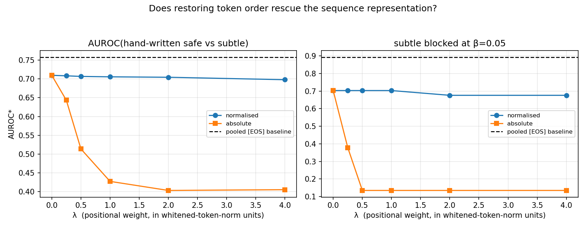

| $\lambda$ | 0 | 0.25 | 0.5 | 1 | 2 | 4 |
|---|---|---|---|---|---|---|
| normalised position | 0.709 | 0.708 | 0.707 | 0.705 | 0.704 | 0.698 |
| absolute position | 0.709 | 0.643 | 0.514 | 0.427 | 0.403 | 0.405 |

Normalised position is flat-to-declining; absolute position is catastrophic,
because it penalises length differences, which are noise. **Order contributes
nothing.** The explanation in §11.5 was half wrong: what the pooled vector has
and the bag lacks is the *contextual integration* performed by twelve layers of
causal attention, not the ordering.

### 16.2 Direction 1(b): scoring inside the U-Net

The stronger version of direction 1 moves downstream. `unet_features.py` runs
the U-Net for one denoising step at $t=500$ on a **fixed** latent — so the only
variation across prompts is the conditioning — and captures the output of a
cross-attention block, pooled over space. One U-Net forward per prompt: ~20 ms,
still 400× cheaper than generating.

On the generated corpus this is the **best representation measured anywhere in
the project**:

| representation | coverage | FRR-hw | degenerate | subtle | AUROC\* |
|---|---|---|---|---|---|
| CLIP text `[EOS]` | 0.945 | 0.572 | 1.000 | 0.892 | 0.762 |
| **U-Net mid (8×8)** | 0.941 | **0.313** | 0.816 | 0.728 | **0.780** |
| U-Net down2 (16×16) | 0.946 | 0.397 | 0.747 | 0.692 | 0.671 |

+0.018 AUROC\* over the text embedding, and it nearly halves the false-rejection
rate (0.313 vs 0.572). Depth matters: the 16×16 level is much worse than 8×8, so
it is the *deepest, most semantic* cross-attention that carries the signal.

Two qualifications, both important.

**It needs data to estimate.** Repeating on the hand-written corpus, where only
60 reference prompts are available, the U-Net features collapse — degenerate
detection 0.303 against the text embedding's 1.000. The 1280-dimensional feature
covariance cannot be estimated from 60 points. The +0.018 requires the
200-prompt geometry block.

**Spatial pooling was not the problem.** "Flowing upward" is a spatial property,
so mean-pooling 64 positions could plausibly have destroyed the signal. Keeping
a 2×2 layout (5,120 dims) changes nothing: AUROC\* 0.777 against 0.780.

### 16.3 Where the ceiling actually is

The acid test is §4.6's nine prompts that no text-embedding score blocks —
impossible physics and capture artifacts. Measured on the hand-written corpus
where that claim was made:

| representation | the 9 blocked | **AUROC(hand-written safe vs the 9)** |
|---|---|---|
| CLIP text `[EOS]` | 0.012 | **0.501** — chance |
| U-Net mid | 0.000 | **0.603** |

Neither blocks them at $\beta=0.05$. But the threshold-free number is the
informative one: on the text embedding the distinction is **absent** — 0.501 is
exactly chance, the representation contains no information separating "a
waterfall flowing upward" from its in-domain twin. Inside the U-Net it is
**present but weak** (0.603).

This locates the ceiling precisely. It is not that CLIP's pooling is lossy —
the information is not there to lose. Moving downstream recovers some of it,
which is the right direction, but at this corpus size the signal is far too weak
to cross a 95%-coverage threshold.

### 16.4 Direction 2: a synthetic corpus cannot be made representative

§11 asserted that the template corpus failed because it was a construction
rather than a sample. `run_corpus_experiment.py` tests that, using the §12 audit
as a design signal under a protocol that makes the conclusion trustworthy:

> the 120 hand-written prompts are split **once**, at the top, into a
> **dev-audit** half (60) used to iterate on corpus design and a **final-audit**
> half (60) touched exactly once, at the end.

Four generators of increasing effort, plus a positive control:

| corpus | $d_{\text{eff}}$ (at n=60) | FRR vs dev | $p$ | verdict |
|---|---|---|---|---|
| V0 template grid (§11) | 13.9 | 0.533 | 0.0002 | FAIL |
| V1 compositional — variable clause count, 4 registers | 14.3 | 0.483 | 0.0002 | FAIL |
| V2 length-matched to the hand-written distribution | 12.3 | 0.567 | 0.0002 | FAIL |
| V3 vocabulary-grounded — built from dev's own words | 8.9 | **0.000** | 1.00 | **PASS** |
| **[control] hand-written dev → hand-written final** | **42.3** | **0.050** | 0.29 | **PASS** |

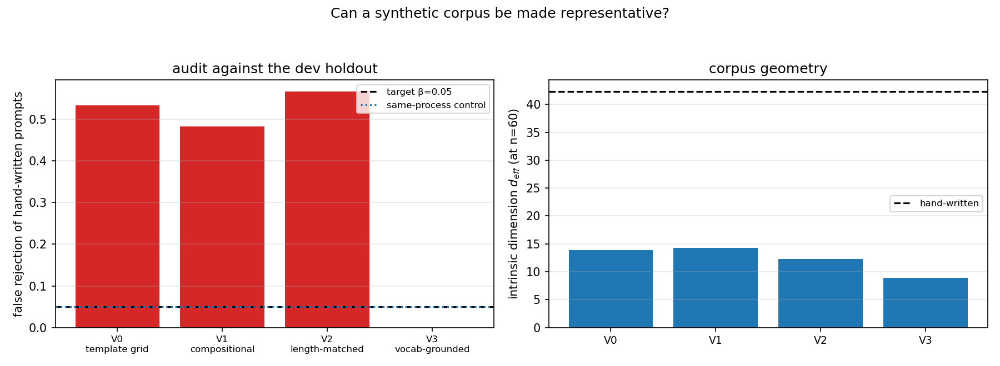

The control passes at exactly $\beta$, so the protocol can pass and the failures
are real.

V3 passed the dev audit and was therefore taken to the final holdout. **It
failed: FRR 0.400, $p=0.0002$.** Textbook selection on the development set —
V3 was built by recombining dev's own vocabulary, so of course it resembled dev,
and the resemblance did not generalise. This is exactly why the dev/final split
was fixed in advance, and it is the clearest demonstration in the project of why
the audit holdout must be spent once.

The mechanism is measurable, at matched sample size: every generator lands at
$d_{\text{eff}}$ 9–14, human writing at **42.3**. Adding structural variety
moved it from 9.8 to 14.3. Matching the length distribution did not help.
Grounding the vocabulary made it *worse*. **Structural variety in a generator
does not produce intrinsic dimension**, and intrinsic dimension is what
representativeness requires.

### 16.5 What this changes

**Direction 1 is confirmed as the right direction and reduced in expected
value.** Scoring inside the U-Net is genuinely better (+0.018 AUROC\*, half the
false rejections) and is the first thing measured that moves the *unblockable*
tier off chance (0.501 → 0.603). But it needs a few hundred prompts to estimate,
and the gain is far short of what a usable filter for compositional failures
would need. Order-aware transport is dead.

**Direction 2 is settled, negatively, and this is the more valuable result.** No
generator I could write passes an honest audit; the best of them passes only by
overfitting the development holdout. Collecting real prompts is not one option
among several — it is the only one. §15.5 called direction 2 "a data task rather
than a modelling one"; that is now demonstrated rather than asserted.

Together these sharpen §15's ranking. The representation ceiling is real but
partially addressable downstream; the corpus problem is not addressable by
synthesis at all. **A representative corpus is the prerequisite, and it must be
sampled, not built.**

**Reproduce:** `python run_ordered_experiment.py` (~4 min),
`python unet_features.py --force && python run_unet_experiment.py` (~3 min),
`python run_corpus_experiment.py` (~3 min).

---

## 17. A bimodal safe set: two landscape families, everything else blocked?

§15.5 direction 3. §4.3 found graph cuts catastrophic and blamed the safe set
being unimodal; `def:pruned_forest` was designed for exactly the multimodal case.
This builds a deliberately bimodal safe set and tests the mechanism where its
premise is supposed to hold.

**Design.** The safe set is two visually and lexically disjoint landscape
families — **desert/arid** (dunes, canyons, salt flats) and **polar/glacial**
(ice, glaciers, tundra), 300 prompts each. The negatives are the informative
part: they are not gibberish but **other landscape types** — forest, coast,
meadow, wetland, tropical, alpine — lexically adjacent to the safe set. `alpine`
deliberately shares snow vocabulary with the polar mode.

Plus the tier that discriminates the geometries: **GAP**, 60 prompts mixing
desert and polar vocabulary ("a wind-scoured sand sea, with drifting sea ice").
A unimodal model of a bimodal set puts its mass between the modes, so these are
exactly the prompts it should wrongly accept.

**The prediction, stated before measuring.** For bimodal $\mathcal D$, MST($\mathcal D$)
contains a long bridge edge. At $n=0$ the score is dominated by that bridge, so
$\varepsilon_0 \approx$ bridge length and the region swallows the gap. At $n=1$
the bridge is cut, $\varepsilon_1 \approx$ within-cluster scale, and the gap is
excluded. So cuts should help, reversing §4.3.

### 17.1 The premise fails: semantically bimodal is not geometrically bimodal

| metric | 2-means ARI | between/within distance | heaviest MST edge |
|---|---|---|---|
| raw Euclidean | **0.973** | 1.156 | within-mode (1.05×) |
| **whitened (m=32)** — the project's metric | **−0.003** | 1.004 | within-mode (1.02×) |
| whitened subspace only | 0.047 | 1.027 | within-mode (1.12×) |
| supervised 1-d (LDA direction) | 0.973 | 9.313 | within-mode (1.56×) |

Two separate failures, and they matter differently.

**The whitening destroys the modes.** In raw space 2-means recovers them almost
perfectly (ARI 0.973). Under the whitened Mahalanobis metric — the one §4.3
established as worth +0.168 for out-of-domain detection — recovery is *exactly
chance* (ARI −0.003). The reason is measurable: the between-mode direction **is
PCA-1** (alignment 0.991, 15.7% of variance), so whitening divides precisely the
separating direction by the largest eigenvalue. Fisher separation falls from
28.7 to 1.94.

This sharpens §14. The residual carries **off-manifold novelty**; the top-$m$
subspace carries **on-manifold structure**. The full Mahalanobis metric mixes
them, and for anything that depends on within-domain structure the mixing is
fatal — the 736-dimensional residual contributes ~25 units of distance against
~8 from the signal.

**The MST bottleneck never sees the modes, in any metric.** Even in the
supervised 1-d projection, where the modes are separated by 9.3× and clustering
is near-perfect, the heaviest MST edge is still *within* a mode. A bottleneck is
destroyed by a single point in the gap, and at ARI 0.973 there are ~3% of them.
One is enough. `n`-cuts inherits this fragility: the statistic it prunes is not
the one that separates the modes.

### 17.2 What the filter does block

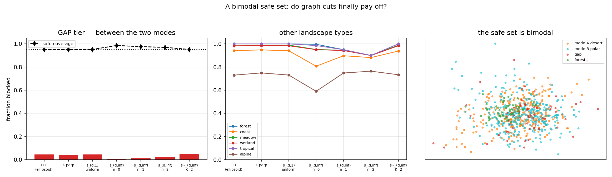

Whitened metric, $\beta=0.05$, 40 splits, coverage 0.95:

| estimator | coverage | **GAP** | forest | coast | meadow | wetland | tropical | **alpine** |
|---|---|---|---|---|---|---|---|---|
| ECF | 0.952 | 0.045 | 1.000 | 0.942 | 0.990 | 0.983 | 1.000 | 0.730 |
| $s_\perp$ | 0.952 | 0.043 | 1.000 | 0.948 | 0.990 | 0.985 | 1.000 | 0.749 |
| $s_{d,1}$ | 0.952 | 0.045 | 1.000 | 0.941 | 0.990 | 0.984 | 1.000 | 0.731 |
| $s_{d,\infty}$ n=0 | 0.986 | 0.005 | 0.997 | 0.807 | 0.952 | 0.950 | 0.985 | 0.590 |
| $s_{d,\infty}$ n=1 | 0.976 | 0.010 | 0.950 | 0.898 | 0.945 | 0.943 | 0.950 | 0.748 |
| $\tilde s_{d,\infty}$ K=2 | 0.952 | 0.047 | 1.000 | 0.938 | 0.988 | 0.984 | 1.000 | 0.733 |

**Other landscape types are blocked well** — 0.94–1.00 for forest, meadow,
wetland, tropical and coast. A filter calibrated on two landscape families does
generalise its rejection to other landscape families, which is the reassuring
half of the answer.

**The exception is `alpine`, at 0.73**, and it is the informative one: alpine
shares snow and ice vocabulary with the polar mode, so partial lexical overlap
costs about a quarter of the detection rate. This is the same phenomenon as the
portrait study's `kayaker` (§4.5) — the filter tracks vocabulary, and shared
vocabulary buys admission.

**The GAP tier is blocked by nothing: 0.005–0.055 across every estimator.** A
filter that has seen 300 desert prompts and 300 polar prompts accepts
recombinations of the two almost without exception, at every level of the
manuscript's hierarchy. This is the unimodality failure the `n`-cuts machinery
exists to fix, and none of the implemented estimators fixes it here — because
§17.1's premise never holds.

### 17.3 Where cuts finally do help

Repeating in **raw Euclidean**, the one metric where the modes are visible:

| estimator | coverage | forest | coast | meadow | wetland | tropical | alpine |
|---|---|---|---|---|---|---|---|
| $s_{d,\infty}$ n=0 | 0.999 | 0.917 | 0.476 | 0.685 | 0.747 | 0.817 | 0.293 |
| $s_{d,\infty}$ n=1 | 0.995 | 0.993 | 0.682 | 0.845 | 0.860 | 0.924 | 0.435 |
| $s_{d,\infty}$ n=2 | 0.992 | **0.998** | **0.741** | **0.885** | **0.898** | **0.944** | **0.484** |

**Cuts improve detection monotonically on every tier** — the first positive
result for `n`-cuts anywhere in this project, and a genuine if partial
vindication of `def:pruned_forest`. Two caveats keep it from being a
recommendation: coverage sits at 0.99+, so the order-∞ regions are loose and the
gain is partly bought with slack; and the raw metric is much worse overall (ECF
forest 0.677 vs 0.942 whitened), so the configuration that lets cuts help is one
you would not otherwise choose.

### 17.4 Conclusion

**Answering the question as asked:** a filter calibrated on two landscape types
blocks other landscape types well (0.94–1.00), degrades gracefully where
vocabulary overlaps (alpine 0.73), and **fails almost completely on novel
recombinations of its own two modes** (GAP 0.005–0.055).

**For the manuscript**, the result is more useful than a simple confirmation.
`n`-cuts is not wrong — it improves detection monotonically when the modes are
geometrically visible — but its premise is not something a prompt corpus
supplies. Semantic bimodality does not become geometric bimodality in CLIP
space, the metric that makes the filter work actively destroys what remains, and
the MST bottleneck is in any case destroyed by a handful of points in the gap.
The double-ring and double-moon datasets have well-separated modes in a
2-dimensional space with no overlap; a 768-dimensional embedding of two prompt
families has neither property.

If multimodal support estimation is to be tested properly on this kind of data,
the missing ingredient is a **metric under which the modes are separated** —
which here would have to be learned from mode labels, taking it outside the
unsupervised setting the estimators assume.

**Reproduce:** `python run_multimodal_experiment.py` (whitened, default),
`MM_METRIC=raw python run_multimodal_experiment.py`, `MM_METRIC=subspace ...`.

### 17.5 Correction: the GAP "failure" is mostly not one

§17.2 calls the GAP result a near-total failure — 0.005–0.055 blocked. That
judges the filter by prompt *vocabulary*. The images say otherwise.


Generating the prompts shows what the model does with a mixed instruction. *"A
crystalline playa under a sky of thin cirrus"* renders as an ordinary salt flat;
*"a sun-scoured frozen lake"* as an ordinary frozen lake. **Stable Diffusion
resolves the mixed vocabulary onto one of the two safe modes rather than
producing a hybrid.** If the image is in-domain, accepting the prompt is the
right decision, and counting it as a miss is an artefact of the label.

The same applies to `alpine`. The one example the filter accepts is *"a
photograph of a snow-dusted rock face"*, whose image is snow on rock — visually
indistinguishable from the polar mode. It is labelled `alpine` by construction,
not by content.

To settle this by measurement rather than inspection, `image_validation.py`
generates 16 images per tier, embeds them with CLIP's **image** encoder, and
builds a *second* conformal safe set in image space from the desert and polar
images. A prompt whose image falls inside that set should have been accepted.

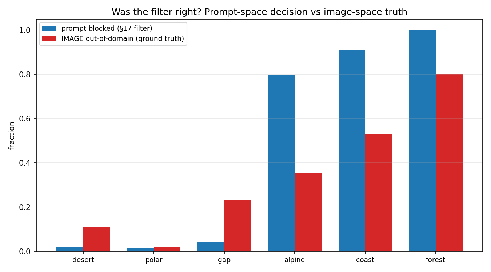

| tier | prompt blocked (§17) | **image out-of-domain** | verdict |
|---|---|---|---|
| desert (safe) | 0.021 | 0.112 | correct |
| polar (safe) | 0.018 | 0.022 | correct |
| **gap** | **0.042** | **0.232** | **accept was largely right** |
| alpine | 0.797 | 0.353 | correct |
| coast | 0.912 | 0.532 | correct |
| forest | 1.000 | 0.801 | correct |

The two columns rank the six tiers identically. GAP images are 23%
out-of-domain, far closer to the safe modes (2–11%) than to the genuine
negatives (35–80%): the model really does collapse mixed prompts onto the modes
it knows.

**Revised conclusion.** The filter under-blocks GAP by roughly 19 points
(blocking 4% where the images justify ~23%) — a real but modest miss, not the
collapse §17.2 describes. The multimodality concern is smaller than the
prompt-space numbers suggest, because the generator itself does not produce the
hybrids the vocabulary implies.

**The methodological point is the more useful one.** Every detection number in
this document is measured against tiers defined by how prompts were *written*.
Where the model resolves a prompt to something other than its words suggest,
that labelling is wrong and the filter is blamed for it. Validating decisions
against generated images costs one batch of generations and is the only way to
tell a filter's error from a label's.

**Reproduce:** `python multimodal_gallery.py` (~4 min),
`python image_validation.py` (~13 min, caches the images).

---

## 18. What a blocked prompt looks like after projection

§6 established that at the calibrated radius the metric projection is
semantically inert. The bimodal safe set makes the geometry sharper, because the
projection now has to **choose a mode**, and `multimodal_projection.py` shows
what that produces.


Four blocked prompts, projected onto the desert+polar safe set with the
union-of-balls region and the `sequence` lift. Every panel is certified inside
the safe set.

| prompt (blocked) | `repair_t` = 0 | 0.6 | 1.0 | mode chosen |
|---|---|---|---|---|
| misty old-growth forest | unchanged | golden grass, open sky | **sand dunes** | desert |
| jungle river with vines | unchanged | **sand dunes** | sand dunes | desert |
| salt-sprayed headland | unchanged | **salt flat** | salt flat | desert |
| windswept summit ridge | unchanged | snowfield, treeline | **snowfield in mist** | **polar** |

**The metric projection changes nothing.** All four `repair_t = 0` panels are
visually identical to the originals — the same result as §6, now shown on a
bimodal set. The certificate is real and the image is untouched.

**`repair_t` works, and the transition is gradual.** By 0.6 the images have
crossed into the safe domain; at 1.0 they are clean desert or polar scenes,
because that point *is* a real safe prompt's conditioning.

**Mode selection is semantically correct.** The three warm or wet prompts —
forest, jungle, coastal headland — project to the **desert** mode; the snowy
alpine ridge projects to the **polar** mode. Nothing supervised that choice; it
falls out of which anchor happens to be nearest.

That last point is worth isolating, because the numbers alone would have missed
it. In flattened sequence space the two mode *centroids* are only **2.63** apart
while the projection radius is **25.10** — a factor of ten. By any
centroid-based measure the modes are indistinguishable, and the projections all
land equidistant from both (§18's table prints "GAP" for every row). Yet the
nearest *individual anchor* still carries the mode, and the images show it.

**This is an argument for the union-of-balls geometry over the ellipsoid.** A
convex region projects toward the global centroid μ, which for a bimodal set
lies between the modes where there is no data. The union of balls projects into
the nearest ball and therefore commits to a mode — and the commitment is
semantically right even when the mode centroids are, at the scale of the radius,
the same point. §5's taxonomy treated the two geometries as interchangeable at
equal coverage; on a multimodal safe set they are not, and the difference is
visible in the output rather than in the metrics.

**Reproduce:** `python multimodal_projection.py` (~5 min).

---

## 19. Prompts that are not landscapes at all

§18 projected other *landscape* types — near neighbours. This asks what happens
far away: a portrait, a subway carriage, a plate of pasta, a cat, an SQL
injection string, all against the desert+polar safe set.


**How far outside are they?** All blocked, and correctly ranked further out than
the landscape negatives — but by a modest margin:

| prompt | distance to the safe set |
|---|---|
| coastal headland | 1.11 × radius |
| misty forest | 1.27 × |
| studio portrait | 1.47 × |
| plate of pasta | 1.48 × |
| tabby cat | 1.48 × |
| SQL injection | 1.55 × |
| Tokyo subway | 1.61 × |

A subway carriage is 1.6 radii out where a forest is 1.3. The ordering is right;
the separation is thin — the same distance concentration that runs through the
whole project.

**The metric projection (`repair_t` = 0) changes the image but not the
category.** This differs from §18, where the landscape projections were
*invisible*. Relative displacement explains it:

| | coast | forest | portrait | subway | cat |
|---|---|---|---|---|---|
| displacement at t=0 | 0.106 | 0.219 | 0.331 | 0.397 | 0.340 |

Far prompts sit further out, so the projection moves them 2–3× as far, and
something visible happens: the portrait becomes a *different* portrait in a
painterly style; the SQL keyboard becomes a screen full of dialog boxes; the cat
disappears, leaving the stone wall and window it was sitting on. But a subway is
still a subway and pasta is still pasta. **A certified projection at the
calibrated radius does not leave the category, however far outside the prompt
started.**

**`repair_t` still works, and does not break down.** The concern going in was
that interpolating between "a studio portrait of a woman" and "a sand dune"
would pass through conditioning the model has never seen. It does not. Every
intermediate is a coherent image:

| prompt | t = 0.5 | t = 1.0 |
|---|---|---|
| portrait | grey-blue banded ice field | frozen lake with treeline |
| subway | canyon with roads and bridges | canyon with vegetation |
| pasta | rippled sand | sand dunes |
| cat | pack ice under blue sky | blue ice cave |
| SQL | frost formations, dark sky | frost formations |

By t = 0.5 all five have crossed into the safe domain — sooner than the
landscape cases of §18, which needed t ≈ 0.6, because the larger displacement
covers the distance faster. At t = 1.0 the output *is* a real safe prompt's
conditioning, so the image is necessarily a clean desert or polar scene.

The subway row is the one imperfection: at t = 1 the canyon still carries roads
and structures. The nearest anchor for that prompt is a wadi or alluvial fan,
and Stable Diffusion draws those with human infrastructure often enough that the
trace survives. It is a property of the generator's prior, not of the
projection.

**What this adds.** §6 concluded that the metric projection is semantically
inert; §19 refines that. Inertness is a function of how far outside the prompt
starts. Near the boundary the projection is invisible; far outside it visibly
perturbs the image while still preserving its category. In neither case does it
reach the safe domain — that requires `repair_t`, which is a chosen
displacement, not a statistical guarantee.

**Reproduce:** `python farfield_projection.py` (~6 min).

---

## 20. Does adapting the region create the gap that `repair_t` fixes?

A hypothesis worth testing directly: the adaptive score $g^{(0,K)}$ builds its
region from only the $K$ anchors nearest in **task** space. If the task metric
mis-ranks, the region is centred on the wrong part of the support, the radius
must inflate to keep coverage, and `repair_t = 1` lands on a semantically
inappropriate safe prompt. The adaptation would then be *creating* the gap that
`repair_t` exists to close.

The bimodal safe set of §17 makes this checkable, because every anchor carries a
ground-truth mode. Swept: $K \in \{2,3,5,10,25,50,100,300\}$ with $K=300=M$ the
non-adaptive score, and $n_{\text{cuts}} \in \{0,1\}$; 300 anchors (150 per
mode), 200 calibration, 100 test, in flattened whitened sequence space.

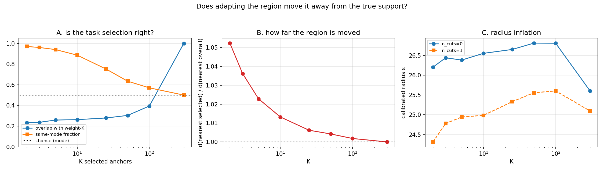

### 20.1 The task metric mis-ranks — but it picks the right mode

| $K$ | overlap with weight-$K$ | $d(\text{nearest selected})/d(\text{nearest overall})$ | same-mode fraction |
|---|---|---|---|
| 2 | 0.234 | **1.052** | **0.970** |
| 5 | 0.259 | 1.023 | 0.940 |
| 25 | 0.279 | 1.006 | 0.752 |
| 100 | 0.395 | 1.002 | 0.570 |
| 300 (non-adaptive) | 1.000 | 1.000 | 0.500 |

Two facts that pull in opposite directions.

**The selection really is "wrong" in the metric sense.** Only ~23–40% of the
task-nearest $K$ are among the weight-nearest $K$. The task metric does not
reproduce the weight-space ranking.

**But it is right in the semantic sense.** At $K=2$, **97%** of selected anchors
come from the query's true mode, against a chance rate of 50%. The task
descriptor identifies the right *family* while getting the within-family
ordering wrong.

And the consequence for the geometry is small: the nearest selected anchor is
only **5% further** than the nearest anchor overall at $K=2$, and under 1% for
$K\ge25$. Distance concentration does this — when all anchors are roughly
equidistant, picking a different subset barely changes the distance to the
closest one.

### 20.2 The projection is insensitive to $K$; `repair_t` is entirely determined by it

| $K$ | $\varepsilon$ | coverage | forest | coast | alpine | $d(\text{proj},\text{real})$ | repair hits weight-nearest |
|---|---|---|---|---|---|---|---|
| 2 | 26.21 | 0.930 | 1.000 | 0.983 | 0.883 | 25.67 | **0.096** |
| 5 | 26.39 | 0.940 | 1.000 | 0.950 | 0.850 | 26.21 | 0.170 |
| 50 | 26.81 | 0.980 | 1.000 | 0.917 | 0.717 | 26.80 | 0.386 |
| 300 | 25.60 | 0.960 | 1.000 | 0.967 | 0.833 | 25.60 | **1.000** |

The radius does inflate — 25.60 non-adaptive up to 26.81 — but only by 2–5%.
Detection is if anything slightly *better* at small $K$ (alpine 0.883 at $K=2$
against 0.833 non-adaptive), because a union of 2 balls is a smaller set than a
union of 300 even at a marginally larger radius.

**The projection lands the same distance from real data whatever $K$ is**:
25.67 at $K=2$ against 25.60 non-adaptive. The hypothesis does not hold for the
projection.

**It holds completely for `repair_t`.** At $K=2$ the repair lands on the anchor
that was actually nearest in weight space only **9.6%** of the time.

### 20.3 What that looks like

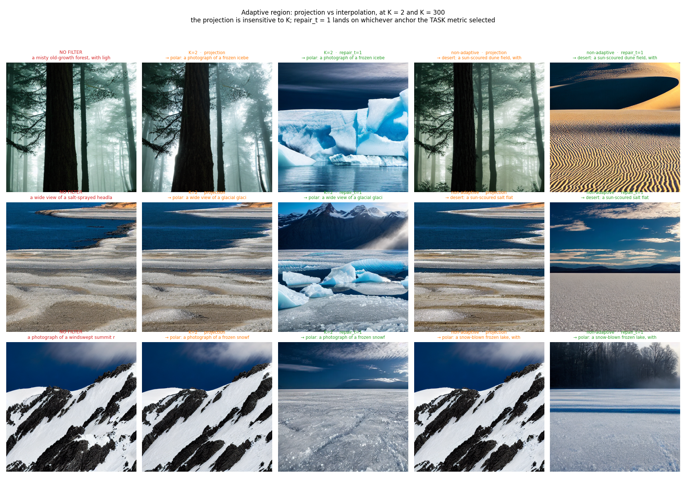

| blocked prompt | $K{=}2$ projection | $K{=}2$ repair | non-adaptive projection | non-adaptive repair |
|---|---|---|---|---|
| misty old-growth forest | unchanged | **blue icebergs** (polar) | unchanged | **sand dunes** (desert) |
| salt-sprayed headland | unchanged | **glacial ice** (polar) | unchanged | **salt flat** (desert) |
| windswept summit ridge | unchanged | frozen snowfield (polar) | unchanged | frozen lake (polar) |

Columns 2 and 4 are visually identical — to each other and to the unfiltered
image. The projection does not care about $K$.

Columns 3 and 5 are completely different, and for two of the three prompts they
send the same input to **opposite modes**: the forest becomes an iceberg under
$K=2$ and a sand dune under the non-adaptive score.

### 20.4 Verdict on the hypothesis

**Half right, and the half that is right is the useful half.**

*For the projection: no.* Adapting the region does not move it away from the
support in any way that matters. Distance concentration keeps the nearest
selected anchor within 5% of the nearest anchor overall, so the projected point
lands essentially where the non-adaptive projection would. `repair_t` is not
fixing a problem the adaptation created — §6's gap is there for the
non-adaptive score too, and is caused by $\varepsilon$ exceeding the anchor
spacing, not by selection.

*For `repair_t`: yes, entirely.* The destination is whichever anchor the task
metric ranked first, and at $K=2$ that is the weight-nearest anchor only 10% of
the time. Two settings of one hyperparameter send the same prompt to opposite
modes.

Whether that is a *fault* depends on the query. For an **in-domain** prompt the
task metric picks the right mode 97% of the time, so the destination is
appropriate. For a **blocked** prompt there is no correct answer — a forest is
out of domain, so an iceberg and a dune are both valid repairs, and the
$K$-dependence is arbitrary rather than wrong.

**Practical consequence.** If repair destinations need to be predictable, use
the non-adaptive score: `repair_t = 1` then lands on the genuine weight-nearest
anchor by construction. Small $K$ makes the destination a function of the task
metric, which for out-of-domain queries is close to arbitrary.

### 20.5 Cuts, as a check

$n_{\text{cuts}} = 1$ was swept alongside, and it fails badly at small $K$:

| $K$ | forest blocked, $n{=}0$ | forest blocked, $n{=}1$ |
|---|---|---|
| 2 | 1.000 | **0.083** |
| 5 | 1.000 | **0.000** |
| 50 | 1.000 | 0.550 |
| 300 | 1.000 | 1.000 |

The §4.3 mechanism, now confirmed in the adaptive setting and worse. With $K$
anchors plus the candidate the MST has $K$ edges; a far candidate attaches by
the heaviest, so cutting one removes exactly its contribution and the score
stops depending on $\theta$. **Cuts and small $K$ are the worst possible
combination** — precisely the configuration `adaptation.tex`'s figures use
($K=2$, $n=1$). Keep $n_{\text{cuts}} = 0$ whenever $K$ is small.

**Reproduce:** `python run_adaptive_projection.py` (~8 min),
`python adaptive_gallery.py` (~4 min).
